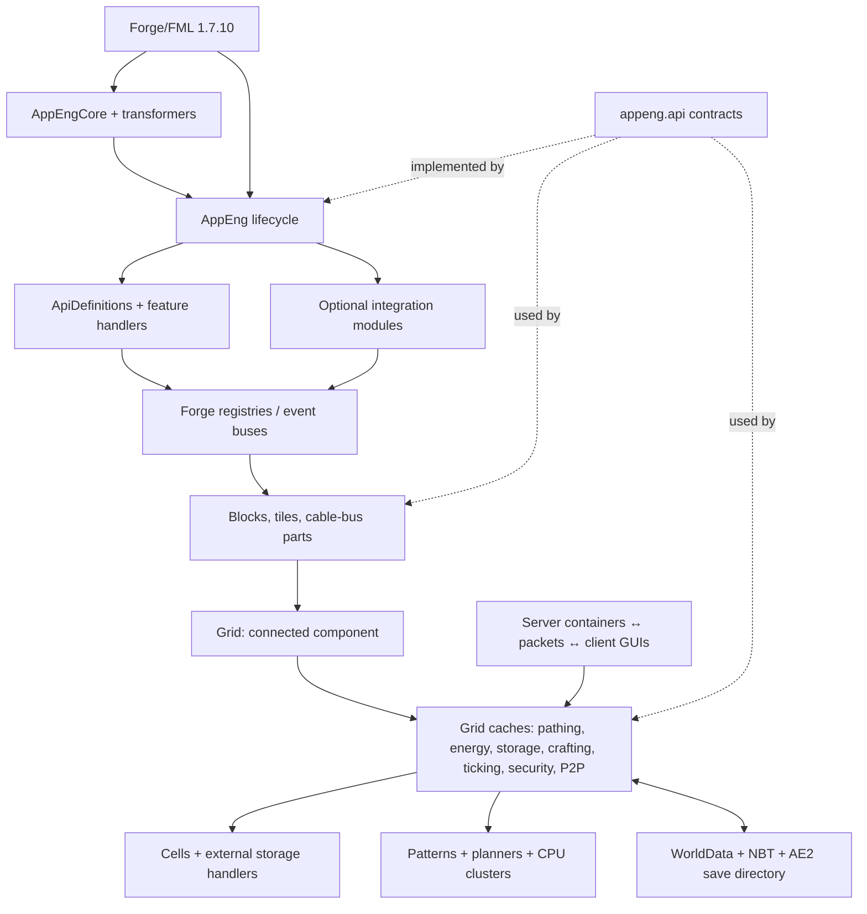

# Project map

## Why this exists

The directory tree mixes addon API, mod implementation, compatibility shims, game objects, client-only rendering, tests that ship in the main source set, and code that is reached by reflection or transformation. This map tells you which boundary a file belongs to before you infer behavior from it. For the shortest conceptual introduction, start at the [guide overview](README.md).

## Repository and source-set map

| Path | What it owns | Important caveat |
|---|---|---|
| [`build.gradle`](../../build.gradle) | Applies `com.gtnewhorizons.gtnhconvention`. | Almost all build behavior is convention-driven; the file's small size does not mean a simple build. |
| [`gradle.properties`](../../gradle.properties#L1) | Mod/Forge identity, mappings, Jabel, API package, AT/coremod, publishing, formatting switches. | It is executable build configuration in property form. `enableModernJavaSyntax=jabel` accepts modern syntax while targeting Java 8-compatible bytecode. |
| [`dependencies.gradle`](../../dependencies.gradle#L1) | Required implementation, compile-only integration APIs, runtime development mods, and test dependencies. | Compile-only presence is not runtime activation; see [integrations](06-integrations-world-and-services.md). |
| [`addon.gradle`](../../addon.gradle#L1) | Adds `functionalTest`, its jar, and client/server launch wrappers. | This is a separate mod loaded into a real deobfuscated game, not the ordinary Gradle `test` task. |
| [`repositories.gradle`](../../repositories.gradle) | Additional dependency repositories. | The convention plugin also supplies well-known repositories because `includeWellKnownRepositories=true`. |
| [`src/main/java/appeng/api`](../../src/main/java/appeng/api) | Bundled public/addon API and compatibility defaults. | Interfaces can still expose internal types for historical compatibility. “Public package” does not promise that every transitive implementation detail is stable. |
| [`src/main/java/appeng`](../../src/main/java/appeng) | Normal mod, coremod, server implementation, client implementation, and HorizonQA game tests. | Side-only and transformed code live in the same source set; classloading boundaries matter. |
| [`src/main/resources`](../../src/main/resources) | `mcmod.info`, access transformer, recipes, translations, textures, sounds, and HorizonQA structures. | Many registrations are driven by metadata or resource names rather than Java callers. |
| [`src/test`](../../src/test) | Fast JVM/JUnit 4 tests for utilities, version parsing, and one world-data name encoder. | It does not boot Minecraft and covers little of the network architecture. |
| [`src/functionalTest`](../../src/functionalTest) | JUnit 5 tests executed by the `appeng-tests` mod inside a real server/client, plus ME mocks. | It is packaged and launched by `runFunctionalTestServer`/`Client`; `test` does not run it. |
| [`src/main/java/appeng/gametests`](../../src/main/java/appeng/gametests) | 58 HorizonQA in-game tests for network, storage, buses, interfaces, I/O port, P2P, power, crafting, and one AE2FC compatibility case. | These ship in `main`; structure templates are under `assets/appliedenergistics2/horizonqastructures`. CI enables HorizonQA through a reusable external workflow. |
| [`docs/codebase-guide`](.) | This evidence-backed guide. | Documentation only; no refactor proposed here has been applied. |

The convention plugin derives an `api` source set/artifact from [`apiPackage=api`](../../gradle.properties#L90), generates `appeng.core.BuildTags` from [`generateGradleTokenClass`](../../gradle.properties#L74), substitutes tokens in `mcmod.info`, applies the access transformer, and creates the coremod manifest wiring from [`coreModClass`](../../gradle.properties#L119). The verified task graph includes `apiClasses`, `apiJar`, `generateAssets`, `reobfJar`, `runClient`, `runServer`, modern-Java launch variants, `test`, `runFunctionalTestServer`, `spotlessCheck`, and Checkstyle tasks. See exact commands in the [development guide](07-development-guide.md#verified-tasks-and-commands).

## Major implementation packages

Counts below are orientation only; responsibilities and canonical types are more useful than volume.

| Package | Responsibility and representative types |
|---|---|
| `appeng.api` | Addon contracts: [`IAppEngApi`](../../src/main/java/appeng/api/IAppEngApi.java), definitions, grid/storage/crafting interfaces, part contracts, configuration enums, and API helpers. Entry: [`AEApi`](../../src/main/java/appeng/api/AEApi.java#L25). |
| `appeng.core` | Normal mod entry, global configuration/logging, definitions/registration, GUI and packet registry, API implementation, world-data coordinator, localization, and statistics. Entries: [`AppEng`](../../src/main/java/appeng/core/AppEng.java#L63), [`Registration`](../../src/main/java/appeng/core/Registration.java), [`Api`](../../src/main/java/appeng/core/Api.java#L33). |
| `appeng.transformer` | FML loading plugin, access/class transformers, optional-interface stripping, bundled-API repair, and vanilla GUI hooks. Entry: [`AppEngCore`](../../src/main/java/appeng/transformer/AppEngCore.java#L29). |
| `appeng.me` | Grid/node/connection model, grid caches, storage aggregation, crafting CPU and multiblock clusters, pathing helpers, and diagnostics. Entries: [`Grid`](../../src/main/java/appeng/me/Grid.java), [`GridNode`](../../src/main/java/appeng/me/GridNode.java), [`GridConnection`](../../src/main/java/appeng/me/GridConnection.java). |
| `appeng.crafting` | Job/link/inventory support plus the `v2` and `fast` planning implementations. Execution lives mainly in `appeng.me.cluster.implementations.CraftingCPUCluster`, so package names do not define the whole subsystem. |
| `appeng.block` | Forge block classes and common block behavior. An `AEBaseTileBlock` usually delegates live state to an `appeng.tile` class. |
| `appeng.tile` | Tile entities, event/NBT/stream dispatch, internal inventories, networking hosts, crafting/storage/spatial machines, and energy sinks. Base: [`AEBaseTile`](../../src/main/java/appeng/tile/AEBaseTile.java#L56). |
| `appeng.parts` | Cable-bus multipart implementations: cables, terminals, buses, planes, panels, P2P tunnels, rendering/collision, and the central [`CableBusContainer`](../../src/main/java/appeng/parts/CableBusContainer.java). |
| `appeng.items` | Item types and item-backed GUI objects, storage cells, tools, encoded patterns, multipart item metadata, inventories, and cell contents. [`PartType`](../../src/main/java/appeng/items/parts/PartType.java#L67) maps multipart metadata to implementation classes. |
| `appeng.container` | Server-authoritative inventory containers, slots, GUI synchronization codecs/actions, and validation. Base: [`AEBaseContainer`](../../src/main/java/appeng/container/AEBaseContainer.java). |
| `appeng.client` | Client proxy, GUI screens/widgets/virtual slots, renderers, textures, effects, input, and client display repositories. Never load these on a dedicated server except behind side-safe indirection. |
| `appeng.integration` | Optional-mod registry/state machine, module implementations, abstraction interfaces, and adapter helpers. Some classes directly reference optional APIs but are loaded reflectively only after detection. |
| `appeng.recipes` | Custom recipe language, loaders, ingredient resolution, handlers, and Forge recipe implementations. Entry: [`RecipeLoader`](../../src/main/java/appeng/core/RecipeLoader.java#L37) and [`RecipeHandler`](../../src/main/java/appeng/recipes/RecipeHandler.java#L65). |
| `appeng.worldgen` | Certus quartz and deterministic meteorite generation. Meteor work is deferred into [`TickHandler`](../../src/main/java/appeng/hooks/TickHandler.java#L80). |
| `appeng.services` | Compass async I/O, version checking, and optional CSV export. These have different lifetimes; do not assume “service” means one framework. |
| `appeng.hooks` | Forge/FML event subscribers, especially the server/world tick coordinator, dispenser/trade hooks, sound, compass result, and crafting notifications. |
| `appeng.server` | Sided server proxy and `/ae2` command dispatcher/subcommands. |
| `appeng.spatial` | Spatial-storage dimension/provider, region capture, NBT transfer, and entangled-dimension bookkeeping. |
| `appeng.fmp` | ForgeMultipart bridge and multipart wrapper. Active only when that integration is enabled. |
| `appeng.util` | Cross-cutting platform helpers, typed stack implementations/lists, inventory adapters, settings, coordinate utilities, and conversion compatibility. High reuse means changes often have large blast radius. |
| `appeng.gametests` | HorizonQA tests and helpers compiled with production code. It is test infrastructure, not a runtime subsystem used in normal play. |
| `appeng.debug` | Feature-gated developer blocks/tools. Do not classify them as dead merely because the feature defaults off. |

## Component map

The arrows describe runtime responsibility, not Java package dependencies. In particular, API types are imported throughout the implementation, while `AEApi` reflectively locates the core implementation so addons can compile to the contract. Read [startup](02-startup-and-runtime.md) for creation order and [ME network](03-me-network.md) for cache ownership.

## Public API versus implementation

### The intended boundary

[`AEApi.instance()`](../../src/main/java/appeng/api/AEApi.java#L32) reflectively reads the public static `INSTANCE` field from [`appeng.core.Api`](../../src/main/java/appeng/core/Api.java#L35). `Api` constructs definition groups, `RegistryContainer`, `ApiStorage`, and `ApiPart`; it also guards node creation as server-only in [`createGridNode`](../../src/main/java/appeng/core/Api.java#L99). Addons should start from API interfaces and registry/definition access, not cast to these implementation classes.

The main contract families are:

| API family | What an addon can express | Internal implementation examples |
|---|---|---|
| `definitions` | Ask whether a block/item/part exists and obtain its stack without hardcoding IDs. | [`ApiDefinitions`](../../src/main/java/appeng/core/ApiDefinitions.java#L24), `ApiBlocks`, `ApiItems`, `ApiMaterials`, `ApiParts` |
| `features` | Registries for storage cells, external storage, grid caches, world generation, P2P, wireless terminals, recipes, and locatables. | [`RegistryContainer`](../../src/main/java/appeng/core/features/registries/RegistryContainer.java), concrete registries in the same package |
| `networking` | Hosts, blocks, nodes, connections, grids, caches, events, pathing, energy, security, ticking, storage, and crafting services. | `appeng.me`, `appeng.me.cache`, `appeng.me.cluster` |
| `storage` | Typed stacks, inventories, monitors/listeners, cells, external adapters, and helper creation. | `appeng.util.item`, `appeng.util.fluid`, `appeng.me.storage`, [`ApiStorage`](../../src/main/java/appeng/core/api/ApiStorage.java) |
| `parts` | Multipart host/part contracts and dynamic tile layers. | `appeng.parts`, [`ApiPart`](../../src/main/java/appeng/core/api/ApiPart.java#L54) |

### Historical leaks and compatibility layers

The boundary is old and intentionally carries compatibility. Examples include deprecated concrete definition holders (`Blocks`, `Items`, `Materials`, `Parts`), default/deprecated overloads in storage and crafting interfaces, and `ApiRepairer`, which replaces stale `appeng.api` classes bundled inside old addons with this jar's copies ([`ApiRepairer.transform`](../../src/main/java/appeng/transformer/asm/ApiRepairer.java#L40)). Therefore:

- A deprecated API method may still be invoked by binary addons even when no current source caller appears.
- A class referenced only by name may be loaded by the integration registry, GUI convention, FML metadata, or transformer.
- Changing API signatures, enum order, NBT keys, registry names, or multipart metadata is a compatibility change even if compilation succeeds locally.

See [refactor risks](08-refactor-map.md) before modifying an apparent legacy path.

## Registration and generated behavior

Feature registration is a two-phase pipeline:

1. Constructing [`ApiDefinitions`](../../src/main/java/appeng/core/ApiDefinitions.java#L33) constructs the block/item/material/part definition sets through `DefinitionConstructor`.
2. [`DefinitionConstructor.registerItemDefinition`](../../src/main/java/appeng/core/api/definitions/DefinitionConstructor.java#L60) records enabled feature handlers and features.
3. [`Registration.preInitialize`](../../src/main/java/appeng/core/Registration.java#L166) calls every handler's `register`, then every feature's `postInit`.
4. A tile block handler registers a Forge block, its custom item form, tile entity, and tile-to-drop mapping ([`AETileBlockFeatureHandler.register`](../../src/main/java/appeng/core/features/AETileBlockFeatureHandler.java#L53)). Cable-bus tile registration is delayed until multipart layers have been selected.

Multipart capability interfaces are stranger. [`Registration.initialize`](../../src/main/java/appeng/core/Registration.java#L525) registers layer classes by interface name. [`ApiPart.getCombinedInstance`](../../src/main/java/appeng/core/api/ApiPart.java#L70) uses ASM to derive a tile class implementing the required layer set and invokes LaunchClassLoader transformers before defining it. That means the runtime class of a cable-bus tile can be generated and will not appear as a source declaration.

Optional interfaces can travel the other direction: [`ASMIntegration`](../../src/main/java/appeng/transformer/asm/ASMIntegration.java#L102) removes annotated methods/interfaces when the corresponding mod integration is disabled. Ordinary call and implementation searches cannot fully represent either mechanism.

## Resources are architecture

| Resource | Runtime role |
|---|---|
| [`META-INF/appeng_at.cfg`](../../src/main/resources/META-INF/appeng_at.cfg) | Makes selected vanilla GUI/render/NBT members public. `ASMTweaker` also performs method-level changes not represented by this file. |
| [`mcmod.info`](../../src/main/resources/mcmod.info) | Tokenized display metadata; the authoritative mod ID/dependency behavior is also in `AppEng` and Gradle properties. |
| [`assets/appliedenergistics2/recipes/index.recipe`](../../src/main/resources/assets/appliedenergistics2/recipes/index.recipe) | Root of AE2's custom recipe import graph. User overrides can replace generated files by relative path. |
| `assets/appliedenergistics2/GTNHRecipes` | Alternate recipe tree selected when the `dreamcraft` mod is loaded. |
| `assets/appliedenergistics2/lang` | Localization keys used by GUI, messages, items, commands, and tooltips. |
| `assets/appliedenergistics2/textures`, `sounds.json` | Client presentation loaded through vanilla/Forge resource conventions. |
| `assets/appliedenergistics2/horizonqastructures` | NBT/JSON fixtures named by `@GameTest(template=...)`. |

## Dependencies by architectural purpose

- Required implementation dependencies are NEI, GTNHLib, and CoFH Core in the current build file. `AppEng.MOD_DEPENDENCIES` explicitly requires Forge and GTNHLib; runtime packaging is governed by the convention plugin.
- Angelica and EnderCore are `compileOnlyApi`, exposing annotations/contracts in the API artifact without making them ordinary bundled implementation dependencies.
- The long `compileOnly` list supplies optional-mod symbols used by integrations and compatibility code. Activation is still decided by `IntegrationNode` at runtime.
- JUnit 4 backs `src/test`; JUnit 5 and a real GT5u dev dependency back `src/functionalTest`; HorizonQA is `devOnlyNonPublishable` and enabled in CI.
- Runtime-only development dependencies assemble a representative GTNH environment, including Waila, Postea, Thaumic Energistics, AE2FC, and NotEnoughEnergistics. They are not proof that every optional integration is always installed for users.

For exact versions, use [`dependencies.gradle`](../../dependencies.gradle#L3). Versions are operational data and should not be copied into new code.

## Active, optional, legacy, generated, and test-only code

Use these tests before deleting a “dead-looking” symbol:

| Classification | How to recognize it | Example |
|---|---|---|
| Active core | Constructed/registered from lifecycle or reached through a grid cache. | `GridStorageCache` registered at [`Registration.java:547`](../../src/main/java/appeng/core/Registration.java#L547) |
| Feature-gated | Definition exists, but `AEConfig.isFeatureEnabled` controls registration. | [`AEFeature`](../../src/main/java/appeng/core/features/AEFeature.java#L13), debug tools |
| Optional integration | Enum entry plus reflectively named module; may have compile-only references. | `IntegrationType.NEI` → `appeng.integration.modules.NEI` |
| Binary compatibility | Deprecated/default method, old NBT key/reader, API-repair target, conversion tool. | `craftableItemsLegacy`, `ApiRepairer`, `ae2stuffConvertor` |
| Runtime-generated | Source is a layer/template, while actual class is emitted or rewritten. | `ApiPart` layer composition; `ASMIntegration` interface stripping |
| Test-only despite `main` | Discovered by HorizonQA annotations and resources. | `appeng.gametests.*` |
| Probably historical but not proven dead | No direct caller and no registration/reference metadata found. | Label as **Uncertain** until jar scanning, addon compatibility, and runtime classloading are checked. |

## Where to go next

- Creation/order questions: [startup and runtime](02-startup-and-runtime.md)
- Connected-component and service questions: [ME network](03-me-network.md)
- Inventory/crafting questions: [storage and crafting](04-storage-and-crafting.md)
- Block/part/GUI questions: [game objects and UI](05-game-objects-and-ui.md)
- Reflection/resources/optional mods/world data: [integrations, world, and services](06-integrations-world-and-services.md)
- Lookup rather than narrative: [evidence index](10-evidence-index.md)
