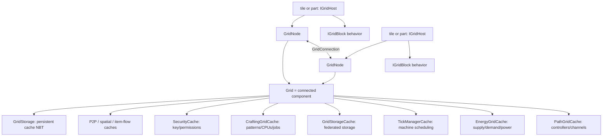

# The ME network

## Why this exists

The ME network is the architectural center of AE2, but “network” names four different things in nearby code: a graph of machines, the per-graph services attached to it, a federated storage inventory, and the FML packet channel. This guide separates those concepts, then follows placement, merge, split, channel, power, tick, security, event, and persistence paths through current implementations.

The smallest correct statement is: **an ME `Grid` is one connected component of `GridNode` vertices and `GridConnection` edges; every grid owns service objects called caches.** Storage is one cache among several. The graph is server-owned and can be rebuilt or divided when world topology changes.

For the objects hosting nodes, see [game objects and UI](05-game-objects-and-ui.md). For the storage/crafting caches, see [storage and crafting](04-storage-and-crafting.md). Terms are defined in the [glossary](09-glossary.md).

## Mental model and where it stops

Imagine offices joined by corridors:

- a tile or part is an office;
- its `IGridNode` is the office's graph vertex;
- an `IGridConnection` is a corridor;
- all mutually reachable vertices form one `Grid` building;
- caches are building-wide departments: power, path/channel allocation, storage, crafting, security, ticking, P2P, spatial, and item-flow.

The analogy stops at identity and mutation. Breaking a corridor can produce a new `Grid`; joining buildings migrates nodes and cache state; special devices create invisible/non-geometric edges; some caches are authoritative services rather than disposable “caches.”



## Contracts and ownership

| Contract | What it owns/describes | Canonical implementation |
|---|---|---|
| [`IGridHost`](../../src/main/java/appeng/api/networking/IGridHost.java#L26) | A tile/part's node lookup, cable connection type, and security-break callback. | Network tiles, `AEBasePart`, cable-bus host. |
| [`IGridBlock`](../../src/main/java/appeng/api/networking/IGridBlock.java#L30) | Node-local behavior: machine, location/world access, connectable sides/color, flags, idle power, grid-changed callback. It need not be a Minecraft block. | Usually [`AENetworkProxy`](../../src/main/java/appeng/me/helpers/AENetworkProxy.java) delegates for a host. |
| [`IGridNode`](../../src/main/java/appeng/api/networking/IGridNode.java#L32) | Incident connections, grid membership, block/host, owner/security/persistence IDs, channel state, lifecycle. | [`GridNode`](../../src/main/java/appeng/me/GridNode.java#L53) |
| [`IGridConnection`](../../src/main/java/appeng/api/networking/IGridConnection.java#L26) | Two endpoints, route orientation, channel use, destruction. | [`GridConnection`](../../src/main/java/appeng/me/GridConnection.java#L40) |
| [`IGrid`](../../src/main/java/appeng/api/networking/IGrid.java#L27) | Component nodes, exact-class machine indexes, caches, grid event bus, pivot, runtime UUID. | [`Grid`](../../src/main/java/appeng/me/Grid.java#L40) |
| [`IGridCache`](../../src/main/java/appeng/api/networking/IGridCache.java#L21) | Per-grid service callbacks for tick, node add/remove, join/split, and persistence. | Implementations registered by `Registration`. |
| [`IGridStorage`](../../src/main/java/appeng/api/networking/IGridStorage.java#L18) | Persistent numeric ID and NBT payload for selected cache state. | [`GridStorage`](../../src/main/java/appeng/me/GridStorage.java#L30) |

Concrete ownership invariants:

- `GridNode` owns its incident-connection list and pointers to one grid, one grid storage, and one `IGridBlock`.
- A `GridConnection` is present in both endpoint lists. A gridless node must have no connections; construction enforces this.
- A nonempty `Grid` has a pivot. During a split, the pivot identifies the component that retains the old `Grid` object/caches.
- Machine lookup indexes the host's **exact runtime class**, not every assignable type. Grid events follow the same exact-class model.
- A connection's `sideA`/`sideB` are not stable semantic directions: pathing can swap them to orient routes toward a controller.
- Graph and cache mutation assumes the server thread; topology collections are not synchronized.
- `getGrid()` is inherently volatile across merges/splits even while a node remains alive. Do not retain a grid reference across world callbacks without revalidating membership.

## Cache construction and dependency wiring

[`Registration.initialize`](../../src/main/java/appeng/core/Registration.java#L543) maps the following public APIs to implementations:

| API/service | Implementation | Role |
|---|---|---|
| `ITickManager` | [`TickManagerCache`](../../src/main/java/appeng/me/cache/TickManagerCache.java) | Adaptive ticks for grid machines. |
| `IEnergyGrid` | [`EnergyGridCache`](../../src/main/java/appeng/me/cache/EnergyGridCache.java) | Providers, requesters, idle/channel costs, public power. |
| `IPathingGrid` | [`PathGridCache`](../../src/main/java/appeng/me/cache/PathGridCache.java) | Controllers, booting, routes, channel allocation. |
| `IStorageGrid` | [`GridStorageCache`](../../src/main/java/appeng/me/cache/GridStorageCache.java) | Typed priority-ordered inventories and monitors. |
| P2P cache API | [`P2PCache`](../../src/main/java/appeng/me/cache/P2PCache.java) | Tunnel frequencies, inputs/outputs, connection rebuild. |
| `ISpatialCache` | [`SpatialPylonCache`](../../src/main/java/appeng/me/cache/SpatialPylonCache.java) | Spatial pylon/region state. |
| `ISecurityGrid` | [`SecurityCache`](../../src/main/java/appeng/me/cache/SecurityCache.java) | Network key, provider, owner, permissions. |
| `ICraftingGrid` | [`CraftingGridCache`](../../src/main/java/appeng/me/cache/CraftingGridCache.java) | Patterns, providers, CPUs, jobs, craftability. |
| Item-flow cache API | [`ItemFlowGridCache`](../../src/main/java/appeng/me/cache/ItemFlowGridCache.java) | Optional item-flow tracking. |

[`GridCacheRegistry`](../../src/main/java/appeng/core/features/registries/GridCacheRegistry.java#L23) validates that an implementation matches its API and has an `IGrid` constructor. [`Grid`](../../src/main/java/appeng/me/Grid.java#L55) reflectively constructs every registered cache, registers cache event subscribers, posts `MENetworkPostCacheConstruction`, registers itself through `TickHandler.INSTANCE.addNetwork` (whose handler owns an [`appeng.me.NetworkList`](../../src/main/java/appeng/me/NetworkList.java)), then adds its center node.

The post-construction event resolves cache dependencies only after all instances exist: for example `EnergyGridCache` captures pathing, while `CraftingGridCache` captures storage/energy and registers itself as a storage-cell provider. Constructors must not assume other caches are ready.

## Placement or load to grid membership

This is the required end-to-end trace for an ordinary grid-connected tile. Multipart differences follow it.

```mermaid
sequenceDiagram
    participant Forge
    participant Tile as AENetworkTile
    participant Proxy as AENetworkProxy
    participant Ticks as TickHandler
    participant Node as GridNode
    participant Neighbor as adjacent IGridHost
    participant Conn as GridConnection
    participant Grid
    participant Caches as all IGridCache instances

    Forge->>Tile: place or read tile NBT
    Tile->>Proxy: set owner / read deferred node tag
    Forge->>Tile: validate()
    Tile->>Proxy: validate()
    Proxy->>Ticks: addInit(tile)
    Ticks->>Tile: onReady() at server END tick
    Tile->>Proxy: onReady()
    Proxy->>Node: create on server; restore p/k/g NBT
    Proxy->>Node: updateState()
    Node->>Neighbor: inspect six sides, color, allowed sides
    alt compatible neighbor
        Node->>Conn: create edge
        Conn->>Grid: merge losing component into winner
    else no neighbor grid
        Node->>Grid: create standalone component
    end
    Grid->>Caches: addNode(node, machine)
    Grid->>Tile: gridChanged()
```

### 1. Placement, NBT, and deferred readiness

[`AEBaseItemBlock`](../../src/main/java/appeng/block/AEBaseItemBlock.java#L139) assigns the placing owner when the tile is `IGridProxyable`. An [`AENetworkTile`](../../src/main/java/appeng/tile/grid/AENetworkTile.java#L26) owns an `AENetworkProxy` and delegates its tile NBT/lifecycle.

On load, [`AENetworkProxy.readFromNBT`](../../src/main/java/appeng/me/helpers/AENetworkProxy.java#L131) retains node data until the live node is created. [`GridNode.loadFromNBT`](../../src/main/java/appeng/me/GridNode.java#L308) restores compact keys `p` (player ID), `k` (last security key), and `g` (persistent `GridStorage` ID). Loading after membership is forbidden, preserving restore-before-join ordering.

`validate` queues the tile; at server-tick end [`TickHandler`](../../src/main/java/appeng/hooks/TickHandler.java#L189) calls `onReady` before grid updates. The proxy asks [`Api.createGridNode`](../../src/main/java/appeng/core/Api.java#L100) for a server-only node, applies deferred state, then calls `updateState`.

### 2. Neighbor discovery and connection

[`GridNode.updateState`](../../src/main/java/appeng/me/GridNode.java#L197) recalculates node flags/capacity, color, and valid sides, delegates to its `FindConnections` visitor, then ensures a grid exists. `FindConnections` checks each adjacent `IGridHost`, both nodes' allowed faces, color compatibility, and existing links; it destroys stale edges and creates missing physical links.

[`GridConnection`](../../src/main/java/appeng/me/GridConnection.java#L204) rejects null/self/duplicate connections and calls `Platform.securityCheck` before mutation. If endpoints belong to different grids, it chooses a winner, propagates the losing component into it, and finally inserts itself into both connection lists. A node without a neighbor-backed grid creates a standalone `Grid`.

### 3. Grid and cache callbacks

[`Grid.add`](../../src/main/java/appeng/me/Grid.java#L126) subscribes/indexes the host's exact runtime class, adopts/divides persistent storage as needed, assigns node storage, inserts the machine, calls every cache's `addNode`, then invokes `gridChanged`. [`IGridCache`](../../src/main/java/appeng/api/networking/IGridCache.java#L37) explicitly warns that grid state is not reliable during add/remove callbacks. Treat those callbacks as classification/dirty-marking phases, not settled-topology transactions.

### Multipart path

[`AEBasePart`](../../src/main/java/appeng/parts/AEBasePart.java#L80) owns a proxy. Only a center `PartCable` proxy is world-accessible; ordinary face parts use internal nodes. [`CableBusContainer.addPart`](../../src/main/java/appeng/parts/CableBusContainer.java#L148) assigns ownership and creates invisible center↔face connections with rollback. On load, it reconstructs parts from NBT; `addToWorld` adds the center first, then face parts, then their invisible links. External node lookup prefers the face part on that side, falling back to the center cable.

Special devices also mutate topology without simple adjacency: quantum links, toggle buses, wireless bases, spatial relays, P2P-ME outer networks, and cable internal links. `PartQuartzFiber` deliberately owns two unconnected `CANNOT_CARRY` nodes and bridges only energy recursively. Never infer all graph edges from neighboring block positions.

## Merge, split, destruction, and rebuild

### Merge

When two endpoints have different grids, [`GridConnection`](../../src/main/java/appeng/me/GridConnection.java#L271) selects the component with higher grid priority, otherwise the larger component. Current priority reflects public powered state. [`GridPropagator`](../../src/main/java/appeng/me/GridPropagator.java) visits the loser; each [`GridNode.setGrid`](../../src/main/java/appeng/me/GridNode.java#L227) removes itself from the old grid and adds itself to the winner. When the loser empties, it saves and joins its persistent `GridStorage` into the winner.

Cache add/remove callbacks happen throughout migration and are not transactional. A callback exception can leave partial membership; callers do not provide a general rollback boundary. This is a high-blast-radius area for error-handling changes.

### Runtime split

[`GridConnection.destroy`](../../src/main/java/appeng/me/GridConnection.java#L88) first dirties pathing, removes itself from both endpoints, then asks both nodes to validate. [`GridSplitDetector`](../../src/main/java/appeng/me/GridSplitDetector.java) searches from an endpoint for the old pivot. If unreachable, that endpoint becomes the center of a new `Grid`, and `GridPropagator` migrates its reachable component. The pivot side retains the old grid/caches; the new side starts with newly constructed caches plus node add/remove-derived state.

An important current behavior is easily misread from the API: ordinary cable/edge removal does **not** call `IGridCache.onSplit`. The only current `onSplit` call is inside `Grid.add` while reconstructing nodes whose persisted `GridStorage` is already bound to another live grid. There, a temporary storage payload carries each cache's `onSplit`/`onJoin` state. Thus runtime and persistence-reconstruction splits are asymmetric. For example, `EnergyGridCache.onSplit` divides overflow energy only on the reconstruction path.

This is established current behavior, not a recommendation. A change needs characterization for every persisted cache and split form; see the [topology refactor candidate](08-refactor-map.md#1-topologycache-lifecycle-and-event-safety).

### Node/world destruction

[`GridNode.destroy`](../../src/main/java/appeng/me/GridNode.java#L249) destroys incident links, preserves the opposite pivot where needed, clears persistent storage at the right point, and removes itself. On world unload, [`TickHandler`](../../src/main/java/appeng/hooks/TickHandler.java#L126) collects and destroys nodes belonging to that world, then removes its world queue. Connections themselves are reconstructed from geometry/special-host state after reload; only node/storage identity is persisted.

## Channels and pathing

An ME **channel** is a finite logical capacity assigned along controller/device paths. It is unrelated to the FML packet channel. [`GridFlags`](../../src/main/java/appeng/api/networking/GridFlags.java) describes channel requirements and carrier constraints: `REQUIRE_CHANNEL`, `COMPRESSED_CHANNEL`, `CANNOT_CARRY`, `CANNOT_CARRY_COMPRESSED`, `DENSE_CAPACITY`, `MULTIBLOCK`, and `PREFERRED`.

[`PathGridCache`](../../src/main/java/appeng/me/cache/PathGridCache.java#L45) tracks controllers, channel-requiring nodes, compressed-path restrictions, totals, boot/controller state, and a repath flag. On an update tick it:

1. recalculates controller validity;
2. enters booting and posts `MENetworkBootingStatusChange` when dirty;
3. runs ad-hoc allocation with no controller, assigns zero for conflict, or runs [`PathingCalculation`](../../src/main/java/appeng/me/pathfinding/PathingCalculation.java) for a valid controller;
4. finalizes transitional node/connection channel counts; and
5. leaves booting and posts the state change.

[`ControllerValidator`](../../src/main/java/appeng/me/pathfinding/ControllerValidator.java) visits connected `TileController` nodes, requires the visited shape/count to agree, and limits every axis to under seven blocks. In ad-hoc mode, the limit is eight unless channels are disabled; over-capacity or invalid compressed transport can deactivate the whole ad-hoc network. Multiblock nodes group as one channel.

For a valid controller, `PathingCalculation` uses controller roots, breadth-first priority (`DENSE_CAPACITY`, then `PREFERRED`, then other device paths), parent-route/bottleneck capacity checks, multiblock grouping, and a postorder propagation. [`ChannelFinalizer`](../../src/main/java/appeng/me/pathfinding/ChannelFinalizer.java) commits `usedChannels` into `lastUsedChannels` and notifies changed endpoints. Pathing may orient a connection toward its controller and move that parent edge to connection-list index zero.

A node is active only when its channel requirement is satisfied, the grid's public power is on, and the path cache is not booting ([`GridNode.isActive`](../../src/main/java/appeng/me/GridNode.java#L297)). Presence in a grid does not imply activity.

### Concrete topology/channel propagation trace

When a cable is removed:

1. its node/connections are destroyed and both sides run split detection;
2. the pivot component retains the old grid; a disconnected component receives a new grid/caches;
3. node remove/add callbacks dirty `PathGridCache` and rebuild provider/service indexes;
4. on a later grid update, pathing enters booting and recalculates controllers/routes/channels;
5. channel finalization posts targeted `MENetworkChannelsChanged` events to changed node machines; a changed connection targets each endpoint node rather than the connection itself;
6. host/caches respond to new activity; energy's channel cost becomes `channelsByBlocks / 128`;
7. storage rebuilds active/inactive contributors and sends monitor changes as node state events arrive.

The exact cache ordering within one `Grid.update` is unspecified, so a consumer should tolerate settling across ticks rather than require pathing-before-energy in the same hash iteration.

## Power and energy

[`EnergyGridCache`](../../src/main/java/appeng/me/cache/EnergyGridCache.java#L49) classifies local and cross-grid providers/requesters, tracks watcher thresholds, cached storage estimates, idle drain, overflow energy, private power, and delayed public power. Its update tick processes thresholds, updates infinite-power/rolling estimates, extracts base idle plus path/channel cost, then changes power state.

Power-down is published immediately; power-up is published only after more than 30 stable ticks. [`setPublicPowerState`](../../src/main/java/appeng/me/cache/EnergyGridCache.java#L211) changes the grid's powered priority flag and broadcasts `MENetworkPowerStatusChange`. Adding a node also receives a targeted initial power event. This debounce helps prevent rapid activation churn, but it means a freshly supplied grid is not immediately publicly active.

Energy extraction/injection recurses through bridges such as quartz fiber using a seen-set and weak “last provider” optimization. Overflow `extraEnergy` is one of the cache values persisted through `GridStorage`.

One source-level accounting concern deserves a test before modification: the update requests `idle + channel` energy but its success comparison uses `drainPerTick` rather than the full requested amount. This suggests public power may not require the complete channel surcharge. It is labeled a likely defect in the [refactor map](08-refactor-map.md), not silently redefined here.

## Device ticking

Global [`TickHandler`](../../src/main/java/appeng/hooks/TickHandler.java) invokes every live `Grid.update` at server-tick end. Each grid then invokes every cache's `onUpdateTick` in unspecified map order.

[`TickManagerCache`](../../src/main/java/appeng/me/cache/TickManagerCache.java) is the device scheduler. An [`IGridTickable`](../../src/main/java/appeng/api/networking/ticking/IGridTickable.java) returns a [`TickingRequest`](../../src/main/java/appeng/api/networking/ticking/TickingRequest.java) with min/max rates and alert/sleep behavior. `TickTracker` starts at the midpoint, orders the next due tick, and clamps modulation such as faster/slower/idle/urgent. Machines or events can sleep, wake, or alert a tracker.

The manager does not independently guard every callback with `node.isActive`; a device's request/event policy is part of correct gating. Changing a request category dynamically also has under-characterized behavior, so add transition tests before restructuring it.

## Security, ownership, and connection validation

[`SecurityCache`](../../src/main/java/appeng/me/cache/SecurityCache.java#L37) tracks security providers, the effective key, permission map, owner, and a startup timer. Exactly one enabled provider yields a valid security key; zero or multiple providers make effective security unavailable. [`TileSecurity`](../../src/main/java/appeng/tile/misc/TileSecurity.java) persists its permission inventory/key and derives the owner from its node's player ID.

Node ownership/security identity persists as `p` and `k`. Before joining two grids, [`Platform.securityCheck`](../../src/main/java/appeng/util/Platform.java#L1514) compares powered security keys and, for secure↔insecure joins, the joining player's `BUILD` permission. A rejected geometric connection queues `MachineSecurityBreak`, which invokes `IGridHost.securityBreak` later.

Storage authorization is separate and action-specific: `NetworkInventoryHandler` checks `INJECT`/`EXTRACT` using a `BaseActionSource`. Passing `PlayerSource` from the server container preserves the player/host context. A successful topology connection is not permission to perform every storage action.

Security intentionally reports unavailable during its first 20 ticks, and current permission checks fail open while unavailable. No later topology revalidation of a join made in that startup window was found. That is a verified call-path gap but needs an in-game regression test before changing semantics.

## Grid event system

[`NetworkEventBus`](../../src/main/java/appeng/me/NetworkEventBus.java#L28) is one bus per grid with global static reflection metadata. It scans public methods annotated for one exact `MENetworkEvent` subtype, indexing cache subscriptions by registered API interface and machines by exact runtime class. Broadcast invokes matching cache and machine sets; a cancelable event stops further dispatch. Targeted dispatch invokes only the exact-class machine attached to the supplied node, not a cache.

Important publishers include post-cache construction, boot/controller/channel changes, public power, idle-power changes, security changes, cell-array changes, and storage-monitor changes. Reflection means annotated subscribers can have no Java callers.

Two current event-safety facts matter:

- `GridNode` and `GridConnection` each reuse a static mutable/cancelable `MENetworkChannelsChanged` object. Cancellation/visited state is not reset, so cancellation of one post can affect later unrelated posts; static reuse also blocks future concurrency.
- `Grid.postEvent`, `GridNode.beginVisit`, and `P2PCache.updateTunnel` pause crafting rebuilds without `try/finally`. An exception can leave the global pause count imbalanced.

These are narrow candidates for characterization and repair; they are not reasons to replace the entire event system at once.

## Persistent grid storage

[`GridNode.saveToNBT`](../../src/main/java/appeng/me/GridNode.java#L323) stores player/security/grid-storage IDs. It does not serialize edges or the runtime grid UUID. World geometry and special-host state recreate connections.

[`GridStorage`](../../src/main/java/appeng/me/GridStorage.java#L30) has a numeric ID and NBT value plus a weak link to a live grid. [`Grid.saveState`](../../src/main/java/appeng/me/Grid.java#L283) asks every cache to populate the value. [`StorageData`](../../src/main/java/appeng/core/worlddata/StorageData.java#L35) lazily maps IDs to compressed Base64 data in `<save>/AE2/settings.cfg`; server stop serializes loaded live nonempty grids.

Persisted cache payloads in the current tree include:

- `EnergyGridCache.extraEnergy`;
- crafting-cache diagnostic/identity state used across join/split;
- `ItemFlowGridCache` tracking state.

Path, tick, storage aggregation, P2P, spatial, and security runtime indexes are rebuilt from nodes/events rather than being complete serialized snapshots.

Two recovery seams require care:

- `AENetworkProxy.writeToNBT` writes live-node data only. Loaded data remains deferred until END-tick readiness, so a save in that narrow window appears capable of dropping deferred `p/k/g`; a test is needed before a fix.
- Corrupt grid-storage Base64/decompression is caught and replaced by an empty tag. This favors world load over preserving corrupt cache data, so migrations should log/test recovery explicitly.

The full file-level save trace is in [integrations, world, and services](06-integrations-world-and-services.md#concrete-persistence-trace-grid-storage).

## Storage/crafting watcher lifecycle caution

Three caches currently key watcher maps by `IGridNode` when adding but look up/remove with the host machine during removal: `GridStorageCache`, `CraftingGridCache`, and `EnergyGridCache`; energy removal additionally checks the stack-watcher interface rather than the energy-watcher interface. The direct consequence is stale watcher entries after node removal. This is an observed implementation mismatch; test node add/remove and notification absence before applying a narrow key/interface fix.

## Invariants and extension points

When adding a grid-connected host or service:

1. Finalize node flags, valid sides, color, owner, and idle power before readiness; `AENetworkProxy.setFlags` does not repath an already-created node.
2. Restore `p/k/g` before membership, then call `updateState` after world access is safe.
3. Use `AEApi.createGridConnection`/established host topology. Insert special invisible edges with symmetric destruction and rollback.
4. Expect add/remove callbacks while topology is unstable. Mark/rebuild state or classify the node; do not traverse assuming the final component.
5. Re-resolve `node.getGrid()`/cache after topology changes rather than retaining old references.
6. Publish/subscribe the existing grid event at the authoritative mutation point; construct fresh mutable events.
7. For a new cache, register API→implementation before live grids, use an `IGrid` constructor, resolve dependencies after cache construction, and define join/split/persistence semantics explicitly.
8. Preserve server-thread mutation. If background computation is introduced, return immutable results to the server tick before changing topology/cache state.
9. Test placement, chunk reload, world unload, merge, both split orientations, controller/no-controller, channel overflow, power debounce, and permission changes.

## Risks, legacy surfaces, and uncertainty

- `IGridCache.onSplit`'s broad contract does not match ordinary runtime split invocation. Document/test actual paths before normalizing them.
- Cache tick/event iteration is hash-order-dependent and exceptions are not transactionally rolled back.
- `GridCacheWrapper` is deprecated and unreferenced in-tree, but public/deprecated API needs addon evidence before removal.
- `IGridBlock.setNetworkStatus` has no in-tree caller and the normal proxy implementation is a no-op; it remains public compatibility surface.
- Singular `MENetworkChannelChanged` has a subscriber but no in-tree publisher; external API users may publish it.
- Fork-specific recursive subnet lookup in [`Grid`](../../src/main/java/appeng/me/Grid.java#L308) is separate from graph membership/pathing. Its depth/visited/parameter behavior has source-level concerns and currently focuses on item storage buses; do not generalize it without tests.
- **Uncertain:** ordinary world-save events visibly flush meteor data but not `StorageData`; server stop does. Establish actual crash durability with an abrupt-termination fixture before claiming or changing guarantees.

## Existing coverage and missing proofs

[`NetworkCoreTests`](../../src/main/java/appeng/gametests/network/NetworkCoreTests.java) covers network boot/activation, split-and-merge storage visibility, channel overflow, and toggle-bus redstone. [`NetworkPowerTests`](../../src/main/java/appeng/gametests/network/power/NetworkPowerTests.java) covers injection and published power; [`P2PTests`](../../src/main/java/appeng/gametests/network/p2p/P2PTests.java) covers remote storage, frequency NBT, and carrier/outer connections.

Direct coverage was not found for cache state across both runtime split orientations, merge-winner selection, duplicate/security-rejected connections, controller conflict/compressed bottlenecks/multiblock grouping, watcher cleanup, mutable event cancellation, security startup, quartz-fiber recursion, proxy save-before-ready, persistent corruption/crash recovery, or adaptive tick-request category transitions. These gaps set the prerequisites in the [refactor map](08-refactor-map.md).

## Related guides

- [Startup and runtime](02-startup-and-runtime.md)
- [Storage and crafting](04-storage-and-crafting.md)
- [Game objects and UI](05-game-objects-and-ui.md)
- [Integrations, world, and services](06-integrations-world-and-services.md)
- [Refactor map](08-refactor-map.md)
- [Evidence index](10-evidence-index.md)
