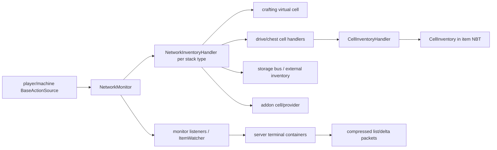
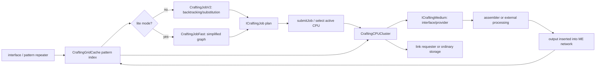

# Storage and crafting

## Why this exists

Storage and crafting are the two services players experience as “the ME system,” but neither is a monolithic inventory or recipe engine. Storage federates typed handlers contributed by cells, buses, interfaces, and virtual providers. Crafting indexes patterns, plans a dependency graph with one of two active planners, selects a CPU cluster, moves ingredients through real media, and accounts for outputs returning asynchronously.

This guide builds those layers from first principles, then traces real insertion/extraction and crafting requests. Read [ME network](03-me-network.md) first for grid/cache ownership and [game objects and UI](05-game-objects-and-ui.md) for the terminal/container boundary.

## Storage mental model

Think of the network storage service as a directory and router over many cupboards:

- an `IAEStack` identifies a typed resource and quantity;
- an `IMEInventory` says how one storage endpoint inserts, extracts, and lists that type;
- an `IMEInventoryHandler` adds policy such as priority, partition, access, and nested-network behavior;
- a cell inventory interprets NBT inside a storage-cell item;
- `GridStorageCache` discovers active providers and builds one aggregate handler per registered stack type;
- `NetworkInventoryHandler` routes operations across those handlers;
- `NetworkMonitor` adds cached listings and change/listener propagation.

The analogy stops at transactions: insertion can be partial, priorities govern order, external handlers can recurse, and a simulate result can be stale before modulate. Callers must honor remainders and authoritative current state.



## Generic stack/type model

[`IAEStack`](../../src/main/java/appeng/api/storage/data/IAEStack.java#L39) is a mutable generic value. In addition to physical `stackSize`, it can carry a requestable amount/count of crafts, a craftable flag, and plan-used percentage. [`AEStack`](../../src/main/java/appeng/util/item/AEStack.java#L31) implements common quantity/metadata and compact packet behavior; production identities are `AEItemStack` and `AEFluidStack`.

[`IAEStackType`](../../src/main/java/appeng/api/storage/data/IAEStackType.java#L20) describes one resource family: identity, NBT/packet decode, list creation, container conversion/fill/drain, display units, and amount-per-byte. [`AEStackTypeRegistry`](../../src/main/java/appeng/api/storage/data/AEStackTypeRegistry.java#L20) statically registers item and fluid and permits addon types. [`AppEng.init`](../../src/main/java/appeng/core/AppEng.java#L181) assigns network IDs to item, fluid, then other registered IDs alphabetically. Generic NBT stores `StackType`; packet encoding prefixes a one-byte type ID, zero for null.

This is an addon boundary and wire/persistence contract. Current caveats:

- only item/fluid types are registered by this repository;
- duplicate string IDs replace an earlier registration;
- the signed-byte ID counter has no explicit >127 guard while lookup rejects values below one; and
- ordinary/void cell factories and several crafting paths remain item/fluid-specific, so a custom type needs its own complete handler path.

[`ItemList`](../../src/main/java/appeng/util/item/ItemList.java) is the canonical item identity map/list: it merges quantities and craftable/requestable metadata, supports fuzzy ore/damage lookup, and lazily builds a sorted view. [`IAEStackList`](../../src/main/java/appeng/util/item/IAEStackList.java) is the heterogeneous wrapper, maintaining one identity-keyed list per registered type.

### Generic versus legacy channel APIs

The codebase is mid-migration from item/fluid-only [`StorageChannel`](../../src/main/java/appeng/api/storage/StorageChannel.java) to registered stack types. Both are live compatibility surfaces:

- `IMEInventory.getChannel()` is deprecated and can derive from `getStackType`; the default `getStackType()` can derive from `getChannel`.
- `IStorageMonitorable` has analogous old item/fluid and new generic defaults.
- `IAEStack` still exposes `isItem`, `isFluid`, and `getChannel`.
- pattern details offer generic arrays but default to deprecated item-array methods for old implementations.

An implementation must override one side correctly; overriding neither can recurse. Do not remove old paths based on deprecation alone, and do not advertise arbitrary stack-type support until cells, planners, CPU execution/spill/poll, interfaces, packets, and displays handle it end to end.

## Inventory and policy layers

[`IMEInventory`](../../src/main/java/appeng/api/storage/IMEInventory.java#L35) is the fundamental typed contract:

- insertion returns the **unaccepted remainder**;
- extraction returns the **amount actually extracted**;
- AE quantities are not constrained by vanilla stack-size limits; and
- listing/exact lookup accepts iteration IDs and filters to account for nested-network traversal/cycles.

`Actionable.SIMULATE` must have no state change; `MODULATE` commits. Simulation is capacity/policy information, not a reservation.

[`IMEInventoryHandler`](../../src/main/java/appeng/api/storage/IMEInventoryHandler.java) adds access mode, priority, partition filter, slot, sticky/two-pass placement, autocrafting interception, and external-network hooks. [`MEInventoryHandler`](../../src/main/java/appeng/me/storage/MEInventoryHandler.java#L36) is the usual policy decorator around an inventory: it applies access and partition visibility, exposes priority/sticky configuration, and forwards nested-network context. Other wrappers add security, pass-through monitoring, vanilla-inventory adaptation, or integration-specific behavior.

Preserve the [`BaseActionSource`](../../src/main/java/appeng/api/networking/security/BaseActionSource.java) through all layers. A `PlayerSource` lets the aggregate enforce player `INJECT`/`EXTRACT`; a `MachineSource` carries its grid/owner context. Replacing it with a generic source can silently weaken authorization or diagnostics.

## Storage cells

### Registry and item-to-inventory construction

`ICellHandler`/`ICellRegistry` is the cell SPI. [`CellRegistry`](../../src/main/java/appeng/core/features/registries/CellRegistry.java) tries registered custom handlers in insertion order and the built-in `BasicCellHandler` last because it accepts any `IStorageCell`. `Registration.initialize` adds creative and void handlers; basic is the fallback.

Normal cells are item objects such as [`ItemBasicStorageCell`](../../src/main/java/appeng/items/storage/ItemBasicStorageCell.java) or `ItemAdvancedStorageCell`. A drive/chest holds those item stacks and exposes handlers through `TileDrive.getCellArray` or `TileChest.getCellArray`; modifying a cell calls back to mark the hosting tile/chunk dirty.

### NBT-backed capacity and policy

[`CellInventory`](../../src/main/java/appeng/me/storage/CellInventory.java#L43) is the normal item/fluid cell store. It:

- validates `IStorageCell`, clamps type slots to 1–63, and reads capacity/restrictions/upgrades;
- rejects a nonempty nested storage cell to prevent pathological nesting;
- charges bytes for quantities and an overhead per distinct type;
- inserts existing types before allocating a new type slot;
- extracts exactly and persists only on `MODULATE`; and
- supports void-overflow semantics, where accepted excess is deliberately discarded.

Its NBT uses per-slot `#n`, long count `@n`, and item/fluid counters (`it`/`ic`, `ft`/`fc`). Loading includes the older per-stack `Cnt` form and compacts broken entries. These names and capacity/status formulas are saved-item compatibility, not internal fields to rename casually.

[`CellInventoryHandler`](../../src/main/java/appeng/me/storage/CellInventoryHandler.java) layers FUZZY, INVERTER, ORE_FILTER, STICKY, and partition policy over the raw inventory. `CreativeCellInventory` exposes configured types at a huge non-mutating quantity; `VoidCellInventory` accepts all and exposes/extracts none. Custom stack types need a custom cell handler because the normal factories instantiate only item/fluid implementations.

## Grid aggregation and priority routing

[`GridStorageCache`](../../src/main/java/appeng/me/cache/GridStorageCache.java#L68) owns one [`NetworkMonitor`](../../src/main/java/appeng/me/cache/NetworkMonitor.java) and lazily creates one [`NetworkInventoryHandler`](../../src/main/java/appeng/me/storage/NetworkInventoryHandler.java) per registered stack type. `ICellProvider` nodes move between active/inactive sets as their node activity changes.

Provider changes use a carefully batched rebuild:

1. snapshot contributed stacks with a sign (+1 add / −1 remove);
2. lock all monitors;
3. invalidate aggregate handlers;
4. reclassify active/inactive providers from `node.isActive()`;
5. force full listener updates and apply signed diffs; and
6. unlock in `finally`.

The aggregate sorts handlers with autocrafting first, sticky next, then priority/placement rules. Insertion gives the crafting virtual cell the first opportunity, then for each priority uses two passes: preformatted/already-containing handlers, then empty/non-prioritized capacity. Simulation tracks what pass one would accept so pass two sees the right remainder. Extraction iterates in reverse to drain the lowest priority first.

[`NetworkInventoryHandler.testPermission`](../../src/main/java/appeng/me/storage/NetworkInventoryHandler.java#L265) enforces security for player and cross-grid machine sources. Iteration IDs and thread-local visited/network accounting prevent a storage bus that reaches another network from recursively enumerating forever. These guards must be balanced with `try/finally` around child calls when refactored.

### Monitoring and change propagation

`IMEMonitor` combines inventory operations with listener registration/cached listing. Listeners implement validity, incremental `postChange`, and full `onListUpdate`. `MEMonitorHandler` is the simple wrapper that computes signed diffs for local modulated operations.

`NetworkMonitor` adds network behavior:

- lock/reshuffle batching and lazy aggregate list caching;
- recursion/nested-diff suppression around aggregate injection/extraction;
- storage interceptors such as interfaces and pattern repeaters before aggregate insertion; the crafting virtual provider instead participates in that aggregate at maximum priority;
- item-flow recording;
- immediate monitor listeners plus exact `ItemWatcher` callbacks; and
- one coalesced `MENetworkStorageEvent` per grid tick.

Terminal containers subscribe to every registered type monitor. Incremental callbacks queue affected identities; full callbacks request a rebuild. On the next container sync tick the server sends current absolute values or a compressed full list. That separates storage authority from the client's display repository.

Polling adapters such as `MEMonitorIInventory` and `MEMonitorIFluidHandler` compare external state to synthesize changes. Their polling interval and external API correctness are part of propagation latency; the fluid adapter explicitly detects a handler returning the wrong fluid on extraction.

## End-to-end storage insertion and extraction

This trace follows a terminal action into a normal drive cell and back to listeners. The first UI/packet steps are expanded in [game objects and UI](05-game-objects-and-ui.md#fully-traced-interaction-terminal-left-click-withdraw-or-deposit).

```mermaid
sequenceDiagram
    actor Player
    participant GUI as GuiMEMonitorable
    participant Packet as PacketMonitorableAction
    participant Container as ContainerMEMonitorable (server)
    participant Power as Platform powered operation
    participant Monitor as NetworkMonitor
    participant Aggregate as NetworkInventoryHandler
    participant Cell as CellInventoryHandler / CellInventory
    participant Tile as TileDrive
    participant Listeners as monitor/watchers/client sync

    Player->>GUI: deposit held item
    GUI->>Packet: target chunks, then action
    Packet->>Container: require current open container
    Container->>Power: poweredInsert(server hand, action source)
    Power->>Power: simulate energy; cap attempted amount
    Power->>Monitor: injectItems(MODULATE)
    Monitor->>Aggregate: permission + cycle check
    Aggregate->>Cell: injectItems(MODULATE)
    Cell->>Tile: saveChanges / mark dirty
    Monitor->>Listeners: accepted positive delta
    Listeners-->>GUI: server list/hand update packets
```

### Insertion

1. `GuiMEMonitorable.sendAction` sends the selected generic stack via `AEBaseContainer.setTargetStack`/chunked `PacketPartialItem`, then `PacketMonitorableAction`.
2. The server verifies the player's current open container and calls [`ContainerMEMonitorable.doMonitorableAction`](../../src/main/java/appeng/container/implementations/ContainerMEMonitorable.java#L633).
3. For a held stack, the container converts the actual server hand and calls [`Platform.poweredInsert`](../../src/main/java/appeng/util/Platform.java#L1341).
4. `poweredInsert` simulates energy, caps the attempted quantity, injects through the monitor, charges only the accepted units, and reconstructs the full original remainder.
5. `NetworkMonitor` delegates to the aggregate. `NetworkInventoryHandler` checks permission/cycle state; autocrafting, sticky, high-priority and two-pass handlers run in order.
6. A selected normal drive handler reaches `CellInventoryHandler` → `CellInventory.injectItems`. A modulated change writes cell NBT and calls the drive save callback.
7. Unwinding through `NetworkMonitor` emits the positive accepted delta, records item flow, invalidates its cached list, notifies list/item watchers, and schedules the coalesced grid storage event.
8. The server container later resolves absolute values and sends the hand/list delta to the client.

At every layer, a non-null insertion return means “not accepted.” Never interpret it as the inserted result.

### Extraction

Terminal shift/single/left/right/region paths call [`Platform.poweredExtraction`](../../src/main/java/appeng/util/Platform.java#L1288). It simulates/caps by available energy, then performs one extraction in the supplied mode; destination/hand capacity checks are action-specific and occur outside this helper. `NetworkMonitor` → `NetworkInventoryHandler.extractItems` traverses lowest priority first. A normal cell extracts precisely, persists, and returns what was obtained; power is charged for the actual amount. If a one-item extraction cannot enter the player's hand, the container reinjects it to avoid loss.

This is not an atomic transaction across arbitrary external handlers. Changes between simulate and modulate yield a smaller extraction/remainder and must be handled.

## Crafting mental model

Crafting has four distinct stages:

1. **Advertisement:** providers expose pattern details; `CraftingGridCache` indexes outputs → patterns/media and publishes craftable/requestable virtual storage entries.
2. **Planning:** a planner snapshots current storage/patterns and computes an `ICraftingJob`; it does not yet reserve a CPU or ingredients.
3. **Submission:** the grid selects a suitable `CraftingCPUCluster`; the CPU replays/extracts the plan against live storage, with rollback on a race.
4. **Execution:** the CPU sends pattern inputs to media, waits for outputs to return through network insertion, routes intermediates/final results, persists links/state, and completes/cancels.



## Patterns, providers, and the virtual crafting inventory

[`ICraftingGrid`](../../src/main/java/appeng/api/networking/crafting/ICraftingGrid.java#L31) is the public entry for pattern lookup, planning, submission, CPU enumeration, emitability, and outstanding requests. [`CraftingGridCache`](../../src/main/java/appeng/me/cache/CraftingGridCache.java#L107) is its sole implementation and also an `ICellProvider`/write-only inventory handler.

After all caches exist it registers itself with storage. Its virtual handler is maximum-priority, pass-one and autocrafting-first: craftable/requestable entries appear in terminal lists, while insertion of produced stacks reaches waiting CPUs before ordinary cells. Pattern rebuild collects providers and media, builds exact generic output, fuzzy substitutions, emitables and compatibility maps, and posts craftability changes to each typed monitor.

Production pattern details are:

- [`PatternHelper`](../../src/main/java/appeng/helpers/PatternHelper.java) for item encoded patterns; and
- [`UltimatePatternHelper`](../../src/main/java/appeng/helpers/UltimatePatternHelper.java) for generic processing/tunnel patterns.

Providers/media include `DualityInterface`, interface block/part/P2P hosts, `PartPatternRepeater`, and level-emitter behavior. A molecular assembler is an `ICraftingMachine`, not itself the grid medium: an interface pushes the pattern directly to it.

## The two active planners

[`CraftingGridCache.beginCraftingJob`](../../src/main/java/appeng/me/cache/CraftingGridCache.java#L605) chooses [`CraftingJobFast`](../../src/main/java/appeng/crafting/fast/CraftingJobFast.java) for lite mode and [`CraftingJobV2`](../../src/main/java/appeng/crafting/v2/CraftingJobV2.java) otherwise. There is no older concrete `CraftingJob` implementation in this tree. “Legacy” here mostly means compatibility methods/maps, not a third planner.

### V2: default, incremental, backtracking planner

`CraftingJobV2` creates a [`CraftingContext`](../../src/main/java/appeng/crafting/v2/CraftingContext.java) with:

- a logged-extraction planning inventory;
- an immutable snapshot of storage available at the beginning;
- byproduct tracking; and
- the generic output→pattern map.

The root request uses `PRECISE_FRESH`, so the requested output is crafted rather than silently satisfied from existing stock. Extensible resolvers registered by [`CraftingCalculations`](../../src/main/java/appeng/crafting/v2/CraftingCalculations.java) cover extraction, emitters, real patterns, simulated patterns/missing, and ignore-missing. `CraftingRequest` tracks ancestry/cycle prevention, substitution grouping, fulfillment, byte cost, and refund/backtracking state.

For a pattern, `CraftFromPatternTask` recursively requests inputs, handles complex recipes one craft at a time, records multi-output byproducts/refunds, and adds pattern counts to the CPU plan. Alternatives are exact then fuzzy, priority-sorted, with ancestor patterns removed. Standard missing resolution marks the job simulated; `IGNORE_MISSING` instead records deficits for later CPU waiting.

Work is incremental and bounded by configured crafting steps. `CraftingJobV2.schedule` registers with [`TickHandler`](../../src/main/java/appeng/hooks/TickHandler.java#L178); world-tick end divides a configured millisecond budget across planning jobs.

### Fast: active lite mode with deliberate limits

`CraftingJobFast` is a separate, active planner optimized for lower calculation cost. Its own documentation states that it omits ore-dictionary/substitution behavior, priorities, complete multi-output correctness, and backtracking, selecting one pattern per output. It builds a dependency graph, uses Tarjan strongly connected components, topologically accounts for tasks/storage/missing resources, and produces the same CPU job representation.

It calculates synchronously, returns an already-completed `Future`, and registers a later callback tick. V2 confirmation tree packets are available only for V2. A refactor must preserve the user/config distinction rather than treating fast as obsolete code.

## CPU clusters, job selection, and execution

[`ICraftingCPU`](../../src/main/java/appeng/api/networking/crafting/ICraftingCPU.java) has one production implementation: [`CraftingCPUCluster`](../../src/main/java/appeng/me/cluster/implementations/CraftingCPUCluster.java#L138). Cluster formation aggregates crafting storage and co-processors; one core tile persists a running cluster's state.

[`CraftingGridCache.submitJob`](../../src/main/java/appeng/me/cache/CraftingGridCache.java#L639) rejects simulations and selects:

- a compatible busy standalone CPU already producing the same output with room when merging is allowed; otherwise
- an idle active CPU with enough crafting bytes and allowed mode.

Ordering considers idle/busy, co-processors, storage, name, and configured power-prioritization/reverse behavior. CPU submission revalidates active/busy/size/support state and replays the plan into a live [`MECraftingInventory`](../../src/main/java/appeng/crafting/MECraftingInventory.java). `commit` attempts current network extraction and reinjects earlier pulls on failure; `IGNORE_MISSING` records deficits. This is the important boundary between a snapshot plan and reserved real ingredients.

On each grid tick, the crafting cache lets CPUs extract newly available missing resources and advance execution. `CraftingCPUCluster.executeCrafting`:

1. chooses pending tasks under an operation budget derived from co-processors;
2. verifies ingredients and finds a non-busy medium;
3. simulates energy;
4. moves CPU ingredients into a crafting inventory;
5. calls `ICraftingMedium.pushPattern`;
6. charges energy and decrements the task; and
7. adds expected outputs/container items to `waitingFor`.

`DualityInterface.pushPattern` validates active/stuck/locked/blocking conditions. It invokes an adjacent `ICraftingMachine` such as [`TileMolecularAssembler`](../../src/main/java/appeng/tile/crafting/TileMolecularAssembler.java) directly, or inserts through inventory adaptors and queues leftovers. The assembler advances work and pushes its result back through the interface/network monitor.

Because the crafting cache's virtual handler is first, returned output reaches `CraftingCPUCluster.injectItems`. The CPU consumes `waitingFor`, stores intermediates, reserves final output still needed by pending tasks, and routes surplus final output through the requester link. A standalone request has no requester half, so output remainder continues into ordinary network cells. A machine requester accepts through `CraftingLink`/`ICraftingRequester`; rejection also continues into normal storage.

Completion means the expected output was produced/accounted for, not necessarily that the original requester accepted every unit. Rejected output in ordinary ME storage can still coincide with a completed job.

## End-to-end crafting request

```mermaid
sequenceDiagram
    actor Player
    participant GUI as terminal / craft amount GUI
    participant Packet as PacketCraftRequest
    participant Cache as CraftingGridCache
    participant Planner as V2 or Fast planner
    participant Confirm as ContainerCraftConfirm
    participant CPU as CraftingCPUCluster
    participant Storage as NetworkMonitor
    participant Medium as DualityInterface
    participant Machine as MolecularAssembler / external process
    participant Link as CraftingLink/requester

    Player->>GUI: AUTO_CRAFT target, amount, mode/lite flags
    GUI->>Packet: request
    Packet->>Cache: validate open container/grid/target; beginCraftingJob
    Cache->>Planner: snapshot storage/patterns and schedule/calculate
    Planner-->>Confirm: Future<ICraftingJob>
    Confirm-->>Player: stored/pending/missing plan (V2 tree if applicable)
    Player->>Confirm: start, or auto-start flag
    Confirm->>Cache: submitJob(job, source, selected CPU)
    Cache->>CPU: select active CPU with enough bytes
    CPU->>Storage: commit live ingredient extraction
    alt race or unavailable ingredients
        CPU->>Storage: rollback prior pulls
        CPU-->>Confirm: submission fails
    else committed
        loop tasks
            CPU->>Medium: pushPattern(inputs)
            Medium->>Machine: execute/craft/process
            Machine->>Storage: insert returned output
            Storage->>CPU: crafting virtual handler consumes waiting output
        end
        CPU->>Link: deliver final output or pass to ordinary storage
        CPU-->>Cache: complete, notify, become idle
    end
```

1. Terminal `AUTO_CRAFT` opens `ContainerCraftAmount` and copies the selected target through [`PacketMonitorableAction`](../../src/main/java/appeng/core/sync/packets/PacketMonitorableAction.java#L47).
2. [`PacketCraftRequest`](../../src/main/java/appeng/core/sync/packets/PacketCraftRequest.java) carries a long amount, shift/control auto-start flags, `CraftingMode`, and lite flag. The server validates the container, grid, and target, calls `beginCraftingJob`, then opens confirmation with the resulting future.
3. [`ContainerCraftConfirm.detectAndSendChanges`](../../src/main/java/appeng/container/implementations/ContainerCraftConfirm.java#L138) waits for calculation and builds stored/pending/missing views plus a V2 tree when supported, or auto-starts.
4. `startJob` calls `ICraftingGrid.submitJob`; the grid selects a CPU and the CPU commits against live storage as described above.
5. A successful submission creates CPU/requester link halves joined by [`CraftingLinkNexus`](../../src/main/java/appeng/crafting/CraftingLinkNexus.java). Execution advances each grid tick until expected returns have been accounted for.
6. `completeJob` marks the link done, notifies requester/listeners, clears metrics/state, and makes the CPU idle.

### Failure, wait, and cancellation

- Missing ingredients in `STANDARD` create a simulated plan; submission rejects it.
- A race during commit reinjects earlier extracted ingredients and fails submission. A `CraftBranchFailure` resets state and informs the player.
- Missing ingredients during execution or a busy/locked/unavailable medium leaves the CPU waiting; there is no general stuck timeout.
- `IGNORE_MISSING` polls only after more than 1200 ticks and currently handles item/fluid branches.
- Cancellation clears tasks/waiting, marks/notifies links and listeners, and reinjects CPU inventory.
- Breaking a CPU cancels and spills its item/fluid contents before destruction to avoid duplication/loss.

These are different terminal states. UI/API code must not collapse “calculation simulated,” “submission race failed,” “running but waiting,” and “canceled.”

## Crafting persistence and link recovery

The selected core [`TileCraftingTile`](../../src/main/java/appeng/tile/crafting/TileCraftingTile.java#L184) stores the running cluster's state. During cluster formation, `CraftingCPUCluster.done` consumes the core's previous NBT. The payload includes:

- final-output accounting and original output;
- internal CPU inventory and waiting/missing lists;
- task patterns and remaining counts/diagnostics;
- CPU/requester link half, source player, allow/suspend/completion flags;
- followers/listeners/notifications; and
- elapsed/count metrics.

Restore recreates pattern details through the stored `ICraftingPatternItem`, restores lists/metrics/links, and resubmits the CPU half. [`MultiCraftingTracker`](../../src/main/java/appeng/helpers/MultiCraftingTracker.java) persists requester halves under `links-n`; [`ApiStorage.loadCraftingLink`](../../src/main/java/appeng/core/api/ApiStorage.java#L43) reads them. `CraftingLinkNexus` reconnects halves by craft ID and eventually cancels when the other half remains absent/invalid.

`CraftingJobV2`'s serialized confirmation tree is GUI transport/testing, not running CPU persistence.

This NBT has no explicit schema version/checksum, includes an unchecked enum ordinal and Java-object-serialized listener data, and silently skips missing/invalid pattern items. These are observed compatibility risks. Historical-save fixtures and round-trip tests are prerequisites to codec extraction or format changes.

## Invariants and extension checklist

### Storage

1. Return the correct semantic value: insertion remainder versus extraction result.
2. Keep `SIMULATE` side-effect free and handle a different `MODULATE` result.
3. Preserve action source, iteration ID/filter, and nested-network recursion context.
4. Keep handler priority/two-pass/sticky/autocrafting ordering and extraction's reverse priority unless semantics intentionally change.
5. On a modulated cell change, update NBT counters/slots and invoke the save callback.
6. Emit one signed change from the authoritative mutation; prevent duplicate nested deltas.
7. Add/remove listeners with the same key/host identity and tolerate invalid listeners.
8. For a custom stack type, prove codec/ID, list, cells, monitor, packets, terminal, crafting, spill/poll, and integration behavior—not just registration.

### Crafting

1. Treat planning as a snapshot and CPU commit as the reservation boundary.
2. Preserve planner selection; Fast/lite and V2 have intentionally different capabilities.
3. Do not submit simulation, canceled, stale, unsupported, inactive, busy, or undersized jobs.
4. Account for multi-output/byproducts/container items and reinject on every rollback/cancel path.
5. Route returned output through `waitingFor` before normal storage, but preserve remainder if a requester rejects it.
6. Balance link halves across node removal, cluster rebuild, requester reload, cancellation, and completion.
7. Preserve CPU NBT keys/read fallbacks or introduce an explicit versioned migration.
8. Test both planning and physical execution; a correct plan does not prove medium/output/link behavior.

## Risks, active legacy, and misleading names

- `GridStorageCache` is the network storage service; `GridStorage` is persistent cache NBT. They are unrelated despite the prefix.
- `CraftingGridCache` is also a virtual storage provider, so crafting output interception happens on the storage insertion path.
- Fast is active lite mode, not the legacy planner. Deprecated channel/pattern/item methods are active addon compatibility.
- “CPU” is the multiblock resource/executor; the planner runs before CPU selection.
- `TileMolecularAssembler` is a crafting machine invoked by a medium, not the grid's `ICraftingMedium`.
- A completed craft means produced/accounted output; requester acceptance can leave remainder in ordinary storage.
- Current watcher maps in storage/crafting add by node but remove by machine, leaving stale watcher entries.
- Equal-priority pattern alternatives are stored in a `TreeSet` comparator that compares only priority, so distinct equal-priority patterns can collapse; CPU task ordering has a separate hash-code tie-break risk.
- `craftableItemsLegacy` is not cleared alongside generic maps, so removed item patterns can remain visible through the deprecated lookup.
- V2 calculation failure/cancellation, `Future.get`, confirmation auto-start, and CPU submission do not form a clearly safe failure contract; add characterization before narrowing it.
- The `AE Crafting Calculator` executor is constructed but no current caller was found; V2 uses world-tick budgeting and Fast calculates synchronously. Do not “fix” lifetime until callers/history and API expectations are tested.
- Recursion/diff guards in `NetworkInventoryHandler`/`NetworkMonitor` are not consistently balanced in `finally`; an exception can poison later work on the same thread.

## Current coverage and missing proofs

- [`DriveAndCellTests`](../../src/main/java/appeng/gametests/storage/drive/DriveAndCellTests.java) covers drive exposure, partitioning, priority insertion, and full-cell fallback.
- [`StorageBusTests`](../../src/main/java/appeng/gametests/automation/storagebus/StorageBusTests.java) covers external exposure/polling, access, priority, and filters.
- [`IOPortTests`](../../src/main/java/appeng/gametests/storage/ioport/IOPortTests.java) covers modes, partitions, exact budgets, fullness/blocked output, power/throughput/redstone/sided behavior, and setting changes.
- [`CraftingV2Tests`](../../src/functionalTest/java/appeng/test/CraftingV2Tests.java) covers simple/missing/fuzzy/cyclic/named/tool/complex/competing/backtracking plans and the GUI tree round trip.
- [`CraftingExecutionTests`](../../src/main/java/appeng/gametests/crafting/CraftingExecutionTests.java) covers assembler/processing execution, cancellation returns, CPU-break duplication safety, and API begin/get/submit.
- [`InterfaceTests`](../../src/main/java/appeng/gametests/interfaces/InterfaceTests.java) covers stocking, blocking, advertisement, block/part parity, and overstock.

Focused tests were not found for Fast planning, monitor recursion/event semantics, watcher cleanup, link-nexus liveness/node removal, CPU NBT reload/historical formats, requester partial rejection, custom stack types, or equal-priority alternative patterns. These gaps drive the sequencing in the [refactor map](08-refactor-map.md).

## Related guides

- [ME network](03-me-network.md)
- [Game objects and UI](05-game-objects-and-ui.md)
- [Startup and runtime](02-startup-and-runtime.md)
- [Development guide](07-development-guide.md)
- [Refactor map](08-refactor-map.md)
- [Evidence index](10-evidence-index.md)
