# Game objects, UI, and synchronization

## Why this exists

The ME network is invisible without Minecraft objects that host it and screens that manipulate it. This layer is also where side mistakes are most expensive: a client GUI is a presentation and intent producer, while a server container, grid cache, tile, or part owns real state. This guide maps block → tile/part → container → packet → server mutation → client replica and makes the validation boundary explicit.

For network services used by these objects, read [ME network](03-me-network.md) and [storage and crafting](04-storage-and-crafting.md). Terms are defined in the [glossary](09-glossary.md).

## Mental model

There are three common forms of player-visible object:

1. A **plain block/item** stores little or no live state in the world.
2. A **tile block** is a Forge block whose position has a tile entity. The block handles placement/collision/activation; the tile owns changing state, inventories, NBT, grid proxy, and stream synchronization.
3. A **cable-bus block** has one `TileCableBus`, which delegates to a `CableBusContainer` holding a center cable and up to six face parts. A terminal, storage bus, cable, and P2P endpoint are all `IPart` implementations sharing that host block.

A GUI then has two parallel object graphs:

```mermaid
flowchart LR
    Input["mouse/key input"] --> Gui["client Gui*"]
    Gui --> Intent["AE2 packet or SyncManager C2S action"]
    Intent --> Channel["FML event channel AE2"]
    Channel --> PacketHandler["server packet handler"]
    PacketHandler --> Container["server Container*"]
    Container --> Domain["tile / part / grid cache / inventory"]
    Domain --> Changes["monitor events, GuiSync, slot changes"]
    Changes --> S2C["server-to-client packets"]
    S2C --> ClientContainer["client Container* replica"]
    S2C --> Gui
```



The client may predict appearance, but the server owns inventory counts, permissions, energy use, job submission, configuration, and persistent state.

## Definitions become Forge objects

Objects are not registered by scanning packages. Constructing [`ApiDefinitions`](../../src/main/java/appeng/core/ApiDefinitions.java#L33) creates concrete definition groups. Each enabled `IAEFeature` contributes an `IFeatureHandler` through [`DefinitionConstructor.registerItemDefinition`](../../src/main/java/appeng/core/api/definitions/DefinitionConstructor.java#L60), and [`Registration.preInitialize`](../../src/main/java/appeng/core/Registration.java#L166) invokes those handlers.

For a tile block, [`AETileBlockFeatureHandler.register`](../../src/main/java/appeng/core/features/AETileBlockFeatureHandler.java#L53):

- derives the stable registry/resource name;
- assigns the creative tab and texture name;
- binds a tile special renderer on the physical client;
- registers the block with a deliberately null Forge item-block factory, then registers the custom item separately;
- registers the tile class; and
- maps that tile class back to its item drop with `AEBaseTile.registerTileItem`.

[`AECableBusFeatureHandler`](../../src/main/java/appeng/core/features/AECableBusFeatureHandler.java#L54) deliberately does **not** register the tile entity. The final cable-bus tile class depends on dynamically selected multipart layers; [`Registration.postInit`](../../src/main/java/appeng/core/Registration.java#L610) finishes FMP support and calls `BlockCableBus.setupTile()`.

### Blocks and items

[`AEBaseBlock`](../../src/main/java/appeng/block/AEBaseBlock.java) centralizes renderer selection, orientation helpers, feature metadata, naming, collision defaults, and client icon behavior. [`AEBaseTileBlock`](../../src/main/java/appeng/block/AEBaseTileBlock.java#L63) adds the tile class and Forge `ITileEntityProvider` contract. Its [`createNewTileEntity`](../../src/main/java/appeng/block/AEBaseTileBlock.java#L116) reflectively constructs that class; activation handles wrench dismantling, memory-card operations, and delegates ordinary use to concrete blocks/tiles.

Items follow the same feature-handler pattern. Two large metadata items deserve special care:

- `ItemMultiMaterial` represents many materials by damage value.
- [`ItemMultiPart`](../../src/main/java/appeng/items/parts/ItemMultiPart.java#L60) represents cable and part variants. [`PartType`](../../src/main/java/appeng/items/parts/PartType.java#L67) is the canonical metadata → feature/integration/class table. `ItemMultiPart.createPart` checks feature flags and optional integrations before exposing a variant.

Metadata values and registry names are persisted in worlds and item stacks. Reordering or compacting them is not an internal cleanup.

## Tile entities: local state and event dispatch

[`AEBaseTile`](../../src/main/java/appeng/tile/AEBaseTile.java#L56) is a non-ticking base until a subclass declares annotated handlers. On the first instance of each tile class, `getEventToHandlers` reflects public methods annotated with `@TileEvent` and caches adapters by `TileEventType` ([`AEBaseTile.java:275`](../../src/main/java/appeng/tile/AEBaseTile.java#L275)). The final vanilla callbacks then dispatch:

| Vanilla/Forge callback | AE2 dispatch |
|---|---|
| `readFromNBT` / `writeToNBT` | `WORLD_NBT_READ` / `WORLD_NBT_WRITE`, after base name/orientation state |
| `updateEntity` | `TICK`; `canUpdate` is true only if such a handler exists |
| description packet stream | `NETWORK_WRITE` on server and `NETWORK_READ` on client |
| `validate` / deferred ready | Network tile subclasses enqueue themselves through `TickHandler`; `onReady` runs at server-tick end |

This reflective mechanism makes an annotated method reachable without a Java caller. When changing a tile, search `@TileEvent`, not only overrides. Also preserve the call to base serialization: `AEBaseTile.readFromNBT` and `writeToNBT` are final in the current tree despite historical compatibility comments around Immibis.

Tile description packets are presentation deltas, not world persistence. [`getDescriptionPacket`](../../src/main/java/appeng/tile/AEBaseTile.java#L154) writes a compact byte stream inside `S35PacketUpdateTileEntity`; [`onDataPacket`](../../src/main/java/appeng/tile/AEBaseTile.java#L185) applies it and requests a render update when handlers report a change. Full state goes through NBT on chunk save/load.

Networked tile bases add a `GridProxy` and expose an actionable node. Follow the concrete inheritance from `AENetworkTile` or `AENetworkInvTile`, not just `AEBaseTile`, when debugging membership or service access.

## Multipart parts and their host

[`TileCableBus`](../../src/main/java/appeng/tile/networking/TileCableBus.java#L51) owns a [`CableBusContainer`](../../src/main/java/appeng/parts/CableBusContainer.java). Its annotated NBT/stream handlers delegate the complete part set to that container. Lifecycle is deliberately deferred:

1. Forge calls `validate`.
2. `TileCableBus.validate` queues the tile with [`TickHandler.addInit`](../../src/main/java/appeng/hooks/TickHandler.java#L88).
3. At server tick end, [`TickHandler.onTick`](../../src/main/java/appeng/hooks/TickHandler.java#L192) calls `onReady`.
4. `TileCableBus.onReady` deletes an empty host or calls `CableBusContainer.addToWorld` ([`TileCableBus.java:176`](../../src/main/java/appeng/tile/networking/TileCableBus.java#L176)).
5. Invalidating or unloading the tile calls `removeFromWorld`, preventing stale grid nodes.

The container owns side selection, collision boxes, facade state, neighbor notifications, drops, redstone, rendering data, and aggregation of each part's grid node. `PartPlacement` and packet handlers locate or create an `IPartHost`, ask the part item for an implementation, validate collision/permission, insert it, and notify the host. A part's `getProxy()` usually owns its node, while a cable can provide the center node that connects face nodes.

### Runtime-generated tile layers

External capabilities such as `ISidedInventory`, `IFluidHandler`, or `ITileStorageMonitorable` must be implemented by the tile class for other mods/Forge to see them. [`Registration.initialize`](../../src/main/java/appeng/core/Registration.java#L525) registers layer templates. [`ApiPart.getCombinedInstance`](../../src/main/java/appeng/core/api/ApiPart.java#L70) composes a subclass with ASM, runs LaunchClassLoader transformers on the emitted bytes, and defines it reflectively. `BlockCableBus.setupTile` chooses that combined class.

Consequences:

- There may be no source declaration for the actual runtime tile class.
- Removing a layer because it has no constructor call can break an external capability.
- Java/classloader upgrades can affect this code even if Minecraft-facing behavior is unchanged.
- FMP pass-through registration happens after integrations are ready in `ApiPart.initFMPSupport`.

## Containers and GUI construction

[`GuiBridge`](../../src/main/java/appeng/core/sync/GuiBridge.java#L146) is the central mapping. Each enum value declares a server `Container*`, expected host type, world/item host mode, and optional `SecurityPermissions`. On the client, [`getGui`](../../src/main/java/appeng/core/sync/GuiBridge.java#L293) derives the GUI class by naming convention: replace `container.` with `client.gui.` and `.Container` with `.Gui`, then load it reflectively. Rename one half without the other and runtime GUI construction fails.

[`Platform.openGUI`](../../src/main/java/appeng/util/Platform.java#L365) is server-only. It checks world interaction and the `GuiBridge` security requirement, encodes GUI ID/side/item-slot information into FML's integer/coordinate arguments, then calls `EntityPlayer.openGui`. The bridge independently reconstructs the host on each side:

- world host: get tile, then the part on the encoded side, then verify the expected class;
- item host: retrieve the exact inventory slot/current stack and call `IGuiItem` or a wireless-terminal registry handler;
- construct a two-argument container/GUI by reflection;
- on the server, attach a [`ContainerOpenContext`](../../src/main/java/appeng/container/ContainerOpenContext.java) so follow-up screens know the original tile/part/side.

`AEBaseContainer` owns the player's `PlayerSource`, anchor (tile, part, or item GUI object), slot rules, held-stack updates, permission polling, open context, and two synchronization systems. Concrete containers should mutate domain state only on the server and use their anchor/grid to revalidate access.

## Synchronization mechanisms

The repository contains overlapping generations of GUI synchronization:

| Mechanism | Best fit | Evidence |
|---|---|---|
| Vanilla container slots/crafters | Ordinary `ItemStack` slots and progress values. | `AEBaseContainer` extends vanilla `Container`. |
| `@GuiSync` + `DataSynchronization` | Legacy/annotation-driven scalar fields. | [`AEBaseContainer.detectAndSendChanges`](../../src/main/java/appeng/container/AEBaseContainer.java#L429) emits `PacketGuiDataSync`. |
| `SyncManager`/`SyncRegistrar` | Typed object sync and named C2S actions with codecs. | `ContainerMEMonitorable` registers `toggleViewCellAction` and `savedSearchSync` near [`ContainerMEMonitorable.java:207`](../../src/main/java/appeng/container/implementations/ContainerMEMonitorable.java#L207). |
| Purpose-built packets | Large/dynamic data: ME item lists, crafting state, interface terminal entries, effects. | [`AppEngPacketHandlerBase.PacketTypes`](../../src/main/java/appeng/core/sync/AppEngPacketHandlerBase.java#L79). |
| Tile description stream | Nearby world rendering state, independent of an open GUI. | [`AEBaseTile.getDescriptionPacket`](../../src/main/java/appeng/tile/AEBaseTile.java#L154). |

Do not add a fourth ad-hoc path without identifying why the existing codec/action or packet path cannot represent the state. Conversely, migrating old paths is protocol-sensitive: packet/action/GUI enums are serialized by ordinal in several places.

## Packet transport and dispatch

`AppEng.postInit` creates [`NetworkHandler("AE2")`](../../src/main/java/appeng/core/AppEng.java#L217), which registers an FML event-driven channel and side-specific handlers. Sending wraps an `AppEngPacket` as `FMLProxyPacket`; receiving reads an integer packet ID, uses the ordinal-indexed `PacketTypes` registry to reflectively call the packet's `ByteBuf` constructor, and invokes its side method ([`AppEngServerPacketHandler.onPacketData`](../../src/main/java/appeng/core/sync/network/AppEngServerPacketHandler.java#L25)).

The packet registry, `InventoryAction`, `MonitorableAction`, several settings, and `GuiBridge` all encode enum ordinals. That is a wire-compatibility invariant: append carefully, never reorder casually, and test mismatched client/server versions if a change is contemplated.

## Fully traced interaction: terminal left-click withdraw or deposit

This trace uses the current generic monitorable terminal path, including multi-stack-type support. It illustrates why “the packet contains an item” does not mean “the client chooses what the server gives it.”

```mermaid
sequenceDiagram
    actor Player
    participant GUI as GuiMEMonitorable (client)
    participant CClient as AEBaseContainer (client copy)
    participant Net as AE2 FML channel
    participant Packet as PacketMonitorableAction (server)
    participant CServer as ContainerMEMonitorable (server)
    participant Monitor as NetworkMonitor / NetworkInventoryHandler
    participant Cache as GridStorageCache
    participant GUI2 as GuiMEMonitorable (client update)

    Player->>GUI: left-click virtual ME slot
    GUI->>CClient: setTargetStack(displayed stack)
    CClient->>Net: PacketPartialItem chunk(s)
    GUI->>Net: PICKUP_OR_SET_DOWN action
    Net->>Packet: parse packet ID and action ordinal
    Packet->>CServer: require currently open ContainerMEMonitorable
    CServer->>Monitor: getAvailableItem(target, fresh iteration id)
    alt player's hand is empty
        CServer->>Monitor: powered extraction (server amount/capacity)
    else player's hand contains an item
        CServer->>Monitor: powered insertion (server hand stack)
    end
    Monitor->>Cache: route across current priority handlers; enforce PlayerSource permission
    Cache-->>CServer: extracted stack or remainder
    CServer-->>Player: mutate authoritative carried stack
    CServer->>Net: UPDATE_HAND and monitor delta/list packets
    Net->>GUI2: update player hand and ItemRepo
```

### 1. Client selects an intent

[`GuiMEMonitorable.handleMonitorableSlotClick`](../../src/main/java/appeng/client/gui/implementations/GuiMEMonitorable.java#L684) maps mouse/modifier state to a `MonitorableAction`. A plain left-click calls `sendAction(PICKUP_OR_SET_DOWN, slotStack, -1)`.

[`sendAction`](../../src/main/java/appeng/client/gui/implementations/GuiMEMonitorable.java#L675) first calls `AEBaseContainer.setTargetStack`, then sends [`PacketMonitorableAction`](../../src/main/java/appeng/core/sync/packets/PacketMonitorableAction.java#L19). On the client, [`setTargetStack`](../../src/main/java/appeng/container/AEBaseContainer.java#L237) serializes the generic `IAEStack` to compressed NBT and sends ordered `PacketPartialItem` chunks of at most 30,000 bytes. The server's open container reassembles these into `clientRequestedTargetItem` through `postPartial`/`parsePartials`.

That target is **untrusted selection context**. It identifies the type the player clicked; it is not an instruction to mint the displayed count.

### 2. Server anchors the action to the open container

[`PacketMonitorableAction.serverPacketData`](../../src/main/java/appeng/core/sync/packets/PacketMonitorableAction.java#L43) returns unless `player.openContainer` is a `ContainerMEMonitorable`. For non-autocraft actions it calls `doMonitorableAction` on that exact server container. The packet does not accept an arbitrary tile coordinate or inventory object.

### 3. Server resolves live state and mutates

At [`ContainerMEMonitorable.doMonitorableAction`](../../src/main/java/appeng/container/implementations/ContainerMEMonitorable.java#L633), the server:

- chooses the item monitor only if the terminal's type filter permits it;
- resolves `getAvailableItem(target, fetchNewId())` from the current monitor, so stale client counts cannot select a larger server amount;
- uses the actual server-side player hand;
- requires a configured power source; and
- calls `Platform.poweredExtraction` or `poweredInsert`, then applies the returned stack/remainder.

The container's action source was created as `new PlayerSource(ip.player, getActionHost())` in [`AEBaseContainer`](../../src/main/java/appeng/container/AEBaseContainer.java#L169). When the operation reaches [`NetworkInventoryHandler`](../../src/main/java/appeng/me/storage/NetworkInventoryHandler.java#L112), `testPermission` asks the network `SecurityCache` for `INJECT` or `EXTRACT` before visiting handlers ([`NetworkInventoryHandler.java:265`](../../src/main/java/appeng/me/storage/NetworkInventoryHandler.java#L265)). Energy and permission are therefore enforced below the packet and GUI layers.

The normal insertion contract returns what could not be inserted; extraction returns what was actually extracted. The container never assumes a requested amount succeeded.

### 4. Server synchronizes the result

The container updates the authoritative carried stack and calls `updateHeld`, which sends `PacketInventoryAction(UPDATE_HAND, serverStack)` back to that player. Storage monitor changes invoke [`ContainerMEMonitorable.postChange`](../../src/main/java/appeng/container/implementations/ContainerMEMonitorable.java#L486), adding affected stack types to `updateQueue`. During `detectAndSendChanges`, the server resolves each changed entry against the current storage list and emits a compressed [`PacketMEInventoryUpdate`](../../src/main/java/appeng/core/sync/packets/PacketMEInventoryUpdate.java#L42); removals are represented with size zero.

On the client, `PacketMEInventoryUpdate.clientPacketData` checks the current screen and calls [`GuiMEMonitorable.postUpdate`](../../src/main/java/appeng/client/gui/implementations/GuiMEMonitorable.java#L214), which updates the display repository. This is eventual display synchronization, not a client mutation of network storage.

## Crafting and sub-GUI actions

When the selected terminal entry is craftable or absent, the same GUI can send `AUTO_CRAFT`. `PacketMonitorableAction` then uses the original `ContainerOpenContext`, opens `GUI_CRAFTING_AMOUNT`, transfers the selected target and primary-GUI descriptor into `ContainerCraftAmount`, and sends initial state. The later confirm/request path is detailed in [the crafting trace](04-storage-and-crafting.md#end-to-end-crafting-request).

`GuiBridge` naming and `ContainerOpenContext` are why a sub-GUI must be opened through existing helpers rather than constructed only on one side. Item-host GUIs also lock the backing player inventory slot in `AEBaseContainer` so moving the item cannot silently change the anchor while open.

## Rendering paths

AE2 uses Minecraft 1.7.10's pre-model renderer stack:

- [`WorldRender`](../../src/main/java/appeng/client/render/WorldRender.java#L30) is the `ISimpleBlockRenderingHandler`; it asks each `AEBaseBlock` for its `BaseBlockRender` and handles inventory/world rendering.
- A tile feature handler calls `CommonHelper.proxy.bindTileEntitySpecialRenderer` only on the client. [`ClientHelper`](../../src/main/java/appeng/client/ClientHelper.java#L136) binds `TESRWrapper` when the block renderer declares TESR support.
- Multipart items use `BusRenderer`, registered through [`ApiPart.setItemBusRenderer`](../../src/main/java/appeng/core/api/ApiPart.java#L264). Cable-bus world rendering aggregates parts/facades and may switch the host tile to a TESR-capable generated class when dynamic rendering is required.
- [`ClientHelper`](../../src/main/java/appeng/client/ClientHelper.java#L109) owns client event subscribers, keybinds, particles, texture hooks, highlights, and preview rendering; [`ServerHelper`](../../src/main/java/appeng/server/ServerHelper.java#L42) provides no-op/unsupported render behavior.
- `GuiButtonColorizer` transforms vanilla `GuiButton.drawButton` to route an OpenGL color call through AE2's `ScreenColor` hook. Call search from `ScreenColor.applyButtonColorHook` alone will not reveal that path.

Rendering state must be derived from synchronized fields/streams. Reading server-only caches directly from a client renderer is both a side violation and unreliable in multiplayer.

## Invariants and extension checklist

When adding or modifying a block, tile, part, or GUI:

1. Decide the persisted owner: item NBT, tile NBT, part NBT, grid-storage cache, or world data. Avoid two authoritative copies.
2. Register through definitions/feature handlers; do not add a naked `GameRegistry` call unless the surrounding pattern requires it.
3. For a tile, use existing `@TileEvent` types and mark save/update at the mutation site. Keep persistent NBT separate from render streams.
4. For a part, verify placement/removal, host save, neighbor notification, grid-node lifecycle, collision, drops, facade interaction, and both static/dynamic render paths.
5. Put authoritative action logic in the server container/domain object. Treat packet fields, selected stack, slot indices, enum values, and coordinates as untrusted until bounded and re-resolved.
6. Reuse `PlayerSource` so storage/security audit context is preserved. Simulate capacity before modulating where partial operations need rollback.
7. Add both sender and receiver tests or a HorizonQA interaction test. A GUI-only manual test does not cover permission loss, power loss, stale displays, or malicious/out-of-order input.
8. Preserve serialized enum order, registry/meta values, GUI mapping convention, NBT keys, and optional classloading unless a migration is designed.

## Risks and misleading names

- A `Container*` exists on both sides, but only the server instance is authoritative.
- `getDescriptionPacket` is a vanilla tile render update, not AE2's custom packet channel and not durable save data.
- `PartType` is an item metadata registry as well as an enum; order is less important than its explicit `baseDamage`, but values still persist.
- `GuiBridge.GUI_Handler` is the FML handler singleton; the other enum constants are mappings encoded into an ordinal.
- `NetworkHandler` transports packets; it is not an ME grid/network implementation.
- `isValid` on monitor listeners is a listener-token validity hook, not player authorization.

## Related guides

- [Startup and runtime](02-startup-and-runtime.md)
- [ME network](03-me-network.md)
- [Storage and crafting](04-storage-and-crafting.md)
- [Integrations, world, and services](06-integrations-world-and-services.md)
- [Evidence index](10-evidence-index.md)
