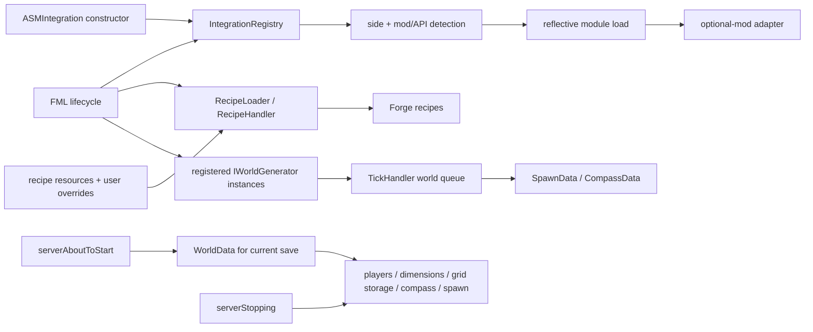
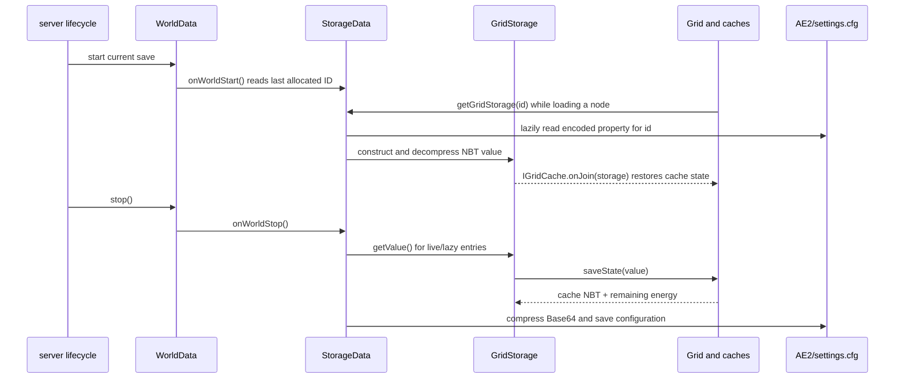

# Integrations, world data, and cross-cutting services

## Why this exists

AE2 has important behavior that is neither an ME-grid cache nor a player-facing block: optional-mod adapters, the recipe language, world generation, save-wide data, commands, and background workers. Much of it is activated by lifecycle callbacks, annotations, reflection, resources, or bytecode transformation. A Java caller search alone can therefore make active code look dead.

This guide explains those activation mechanisms and their lifetimes. Read [startup and runtime](02-startup-and-runtime.md) for the lifecycle that invokes them, [ME network](03-me-network.md) for grid-owned state, and the [glossary](09-glossary.md) for unfamiliar Forge terms.

## Mental model: activation is part of the architecture

Treat every cross-cutting subsystem as a pair:

1. a **discovery/activation path** decides whether and when it exists; and
2. a **runtime path** performs its useful work.

For example, an NEI class is not loaded merely because it is compiled. `ASMIntegration` first populates the integration registry, physical-side and mod-presence checks gate its node, reflection constructs it, and only then does its `init` register NEI handlers. Likewise, a meteorite class is reached through a registered Forge world generator and later a tick queue, while a tile `@TileEvent` handler is called by reflective dispatch.

The arrows describe activation, not a single call stack. The practical rule is to search registration metadata, annotations, resources, and transformer code whenever direct callers are absent.

## Optional-mod integration framework

### Catalog, registry, and lifecycle

[`IntegrationType`](../../src/main/java/appeng/integration/IntegrationType.java) is the supported-integration catalog. It includes IndustrialCraft 2, RotaryCraft, Railcraft, BuildCraft, Redstone Flux/CoFH, MineFactory Reloaded, Factorization, ForgeMultipart, Waila, Inventory Tweaks, NEI, CraftGuide, Mekanism, OpenComputers, PneumaticCraft, GregTech, and others. Some entries are client-only; several split a family into separate capabilities.

The unobvious bootstrap is [`ASMIntegration`](../../src/main/java/appeng/transformer/asm/ASMIntegration.java#L35). Its constructor iterates `IntegrationType.values()` and calls [`IntegrationRegistry.add`](../../src/main/java/appeng/integration/IntegrationRegistry.java). Because FML constructs the transformer before ordinary mod initialization, the transformer participates in application registration as well as transforming bytecode.

`IntegrationRegistry.add` rejects an entry on the wrong physical side, then makes an [`IntegrationNode`](../../src/main/java/appeng/integration/IntegrationNode.java) using the naming convention `appeng.integration.modules.` + enum name. The node advances through three phases:

| Phase | Behavior |
|---|---|
| `PRE_INIT` | Read `AEConfig`'s `ModIntegration` setting. `AUTO` checks `ModAPIManager` or `Loader`; `ON` requests the module; `OFF` suppresses it. Reflectively load and instantiate the class, then assign its public static `instance` field. |
| `INIT` | Call the integration's `init` method. [`AppEng.init`](../../src/main/java/appeng/core/AppEng.java#L181) reaches this after feature/cache/recipe initialization. |
| `POST_INIT` | Call its post-initialization hook from [`AppEng.postInit`](../../src/main/java/appeng/core/AppEng.java#L205). |

Each node records an `IntegrationStage`: `PRE_INIT`, `INIT`, `POST_INIT`, `READY`, or `FAILED`. Disabled or missing integrations reach `FAILED`, normally through `ModNotInstalled`; unexpected failures are logged. The boundary prevents a broken optional adapter from masquerading as ready. This is isolation, not proof that every bad optional class reference is safe: an optional API type loaded outside the guarded module can still crash classloading.

### Why `@Integration.Interface` and `@Integration.Method` exist

[`Integration`](../../src/main/java/appeng/transformer/annotations/Integration.java) defines runtime annotations that describe optional interfaces and methods. `ASMIntegration` parses a class's constant pool before normal loading. When a named integration is unavailable, it can remove the annotated interface from the class or strip the annotated method. This lets core AE2 types expose capabilities such as power sinks, storage-bus interfaces, P2P adapters, or tool interfaces without requiring that optional API at runtime.

This mechanism is active across the codebase, not a historical one-off. Annotated sites occur in storage buses, power classes, cable-bus hosting, P2P tunnels, and tools. A source-level `implements OptionalApi` is therefore not sufficient evidence that the interface exists in the loaded runtime class. Conversely, an annotated method with no ordinary call can be an external-mod entry point.

The transformer does not make arbitrary optional references safe. Keep optional types behind one of these established boundaries:

- a reflectively loaded integration module;
- an annotated interface/method explicitly handled by `ASMIntegration`;
- a tiny common abstraction whose implementation lives in the optional module; or
- a side-safe proxy call for client-only behavior.

### Representative trace: NEI

[`NEI`](../../src/main/java/appeng/integration/modules/NEI.java) is a representative client-only integration:

1. `IntegrationType.NEI` declares the integration and client side.
2. Constructing `ASMIntegration` adds a registry node, but the wrong physical side is rejected.
3. At pre-initialization, the node checks the configuration and NEI presence, then reflectively loads `appeng.integration.modules.NEI`.
4. The module constructor performs additional class/reflection checks for version-varying APIs.
5. `NEI.init` registers the AE2 key, recipe/usage handlers, storage-cell and pattern views, filters, bookmarks, overlays, and input hooks.

This two-stage detection is intentional. Loader presence says the mod exists; the module's reflective probes determine which version-specific hooks are actually usable. **Uncertain:** the repository cannot establish that every supported NEI/GTNH combination exercises every reflective branch. That requires launch tests with the corresponding dependency set.

## Coremod and reflection reachability beyond integrations

Other important indirect paths are summarized here and detailed in [startup and runtime](02-startup-and-runtime.md#coremod-bootstrap):

- [`ApiRepairer`](../../src/main/java/appeng/transformer/asm/ApiRepairer.java) replaces stale `appeng.api` classes embedded by addons with this jar's API bytes, then reruns downstream transformers.
- [`ASMTweaker`](../../src/main/java/appeng/transformer/asm/ASMTweaker.java) changes selected vanilla/AE2 method access and invocation behavior needed by custom slot rendering and compatibility.
- [`GuiButtonColorizer`](../../src/main/java/appeng/transformer/asm/GuiButtonColorizer.java) redirects a vanilla GUI color call to AE2's screen-color hook.
- [`ApiPart`](../../src/main/java/appeng/core/api/ApiPart.java#L70) emits cable-bus tile subclasses, asks the launch classloader to transform their bytes, and defines them reflectively.
- [`GuiBridge`](../../src/main/java/appeng/core/sync/GuiBridge.java#L293) derives a GUI class name from a container name and invokes its constructor reflectively.
- [`AEBaseTile`](../../src/main/java/appeng/tile/AEBaseTile.java#L275) discovers `@TileEvent` methods and dispatches vanilla callbacks to cached adapters.
- Packet handlers instantiate packet classes from an enum-held `Class` and a `ByteBuf` constructor.

When assessing reachability, search annotations and string/class registries as well as call sites. Removing or renaming a reflectively reached constructor can compile cleanly and fail only during a particular launch path.

## Recipe and resource pipeline

AE2 uses a custom recipe language rather than representing its complete recipe set as Java registration calls. [`RecipeLoader`](../../src/main/java/appeng/core/RecipeLoader.java#L37) selects a resource root: `GTNHRecipes` when the `dreamcraft` mod is loaded, otherwise `recipes`. It then chooses between two input models:

- [`JarLoader`](../../src/main/java/appeng/recipes/loader/JarLoader.java) reads the bundled resource tree directly.
- [`ConfigLoader`](../../src/main/java/appeng/recipes/loader/ConfigLoader.java) supports generated files plus user overrides when custom recipes are enabled. The loader creates/refreshes the generated recipe directory, copies bundled recipes and their README, and lets a user file override the generated file at the same relative path.

[`RecipeHandler`](../../src/main/java/appeng/recipes/RecipeHandler.java#L65) parses the small language, follows `import` statements, resolves aliases/ore-dictionary/groups, sorts handlers, and injects Forge recipe objects during initialization. The root [`index.recipe`](../../src/main/resources/assets/appliedenergistics2/recipes/index.recipe) demonstrates that import graph; the alternate GTNH tree has its own index.

Implications for changes:

- A recipe resource is executable registration input. Rename/move it only after following every `import` and override path.
- The generated copy is not the source of truth. Change the checked-in resource, not a runtime-generated config file.
- Test both default and custom-recipe modes when changing loader precedence.
- A loaded mod can change the entire recipe root, so validate the GTNH recipe selection as well as the fallback tree.

Textures, language files, sounds, `mcmod.info`, the access transformer, and HorizonQA structures are also runtime inputs under [`src/main/resources`](../../src/main/resources). Their reachability is typically a registry/resource name rather than a Java caller.

## World generation

[`Registration`](../../src/main/java/appeng/core/Registration.java#L811) conditionally registers [`QuartzWorldGen`](../../src/main/java/appeng/worldgen/QuartzWorldGen.java) and [`MeteoriteWorldGen`](../../src/main/java/appeng/worldgen/MeteoriteWorldGen.java) from feature/config state. [`WorldGenRegistry`](../../src/main/java/appeng/core/features/registries/WorldGenRegistry.java) combines provider/dimension exclusions with explicit enabled-dimension rules.

Quartz generation places the API-defined charged/uncharged quartz ores according to `AEConfig`. Meteorite generation has a more involved path:

1. `MeteoriteWorldGen.generate` derives deterministic region/grid coordinates and checks dimension/provider rules.
2. It queues either `ExistingMeteoriteSpawn` or `MeteoriteSpawn` through [`TickHandler.addCallable`](../../src/main/java/appeng/hooks/TickHandler.java#L80), rather than doing the whole operation inside the Forge generator callback.
3. The queued callable places or reconciles the structure.
4. Spawn metadata is recorded in [`SpawnData`](../../src/main/java/appeng/core/worlddata/SpawnData.java), and compass region data is updated through the compass service.
5. World-save handling flushes pending spawn information.

Deferral separates generation callbacks from bounded world mutation and centralizes later work, but it also makes timing part of behavior. A generation test must advance the appropriate world/server ticks and must not assume the meteor exists immediately after `generate` returns.

## Save-wide `WorldData`

[`WorldData`](../../src/main/java/appeng/core/worlddata/WorldData.java#L43) coordinates data scoped to the current Minecraft save, under its `AE2` subdirectory. [`AppEng.serverAboutToStart`](../../src/main/java/appeng/core/AppEng.java#L241) constructs it for the starting server/save. `serverStopping` asks it to save/close; `serverStopped` clears the singleton and other process-global caches.

Its owned components are deliberately different from tile NBT and grid caches:

| Component | Responsibility and storage |
|---|---|
| [`PlayerData`](../../src/main/java/appeng/core/worlddata/PlayerData.java) | Stable compact security IDs mapped from player UUIDs, saved in configuration data. |
| [`DimensionData`](../../src/main/java/appeng/core/worlddata/DimensionData.java) | Allocate, register, unregister, persist, and synchronize spatial-storage dimension IDs. |
| [`StorageData`](../../src/main/java/appeng/core/worlddata/StorageData.java#L35) | Map persistent grid-storage IDs to Base64-compressed NBT values in `AE2/settings.cfg`. |
| [`SpawnData`](../../src/main/java/appeng/core/worlddata/SpawnData.java) | Persist meteorite/spawn records beneath `AE2/spawndata`. |
| [`CompassData`](../../src/main/java/appeng/core/worlddata/CompassData.java) and [`CompassService`](../../src/main/java/appeng/services/CompassService.java) | Maintain/search region files beneath `AE2/compass` using one scheduled worker. |

`WorldData.instance()` is explicitly deprecated as a world-dependent singleton. That warning matters in integrated servers, test reuse, and restart scenarios: code must not retain a component across server stop/start.

### Concrete persistence trace: grid storage

A grid cache that implements persisted state reads and writes through [`GridStorage`](../../src/main/java/appeng/me/GridStorage.java#L30), not directly through `WorldData`:

[`StorageData`](../../src/main/java/appeng/core/worlddata/StorageData.java#L35) keeps lazy/weak associations so not every historical storage is inflated immediately. Calling `GridStorage.getValue` causes the attached live grid to save its cache state and compacts insignificant extra energy. On reconstruction, topology code can divide or merge `GridStorage`; this is why storage IDs and cache NBT keys are compatibility data rather than implementation detail. The topology side is covered in [ME network](03-me-network.md#persistent-grid-storage).

## Tick queues and background services

[`TickHandler`](../../src/main/java/appeng/hooks/TickHandler.java) is the shared synchronous scheduler:

- world-tick end advances crafting calculations within their configured budget;
- server-tick end updates server colors, readies queued tiles, updates every live `Grid`, and drains the server queue;
- world-tick start drains that world's weakly keyed call queue with a time bound;
- world unload destroys nodes still attached to that world;
- world save flushes spawn data; and
- shutdown clears repositories, queues, and outstanding simulation jobs.

This is Minecraft-thread work unless a called subsystem explicitly delegates. Do not block it with file/network work.

The compass subsystem is explicitly asynchronous: [`CompassService`](../../src/main/java/appeng/services/CompassService.java) owns a single scheduled executor for region updates/searches. [`CompassData.onWorldStop`](../../src/main/java/appeng/core/worlddata/CompassData.java) calls `CompassService.kill()`, which invokes `shutdownNow`. Crafting calculations use a different model: V2 advances under `TickHandler`'s world-tick budget and Fast calculates synchronously. `CraftingGridCache` declares a cached calculator executor, but no current caller was found; see [storage and crafting](04-storage-and-crafting.md).

Other services, such as version checking and optional CSV export, have their own activation/configuration rules. Package placement under `appeng.services` does not imply a common service container or uniform lifetime.

## Commands and login synchronization

[`AECommand`](../../src/main/java/appeng/server/AECommand.java) dispatches `/ae2` subcommands registered from [`AppEng.serverStarting`](../../src/main/java/appeng/core/AppEng.java#L262). The current set includes chunk logging, supporters, profiling, full-access toggling, path debugging, and timing diagnostics, with different permission levels. Treat diagnostic commands as runtime observability surfaces; preserve permission checks when extending them.

FML/player event handlers also synchronize save-wide state. `ServerConnectionFromClientEvent` sends spatial-dimension mappings to that connection; `PlayerLoggedInEvent` triggers the cached player-color broadcast. These are replica initialization paths, not durable storage: the server's `WorldData` remains authoritative.

## Invariants and extension checklist

1. Give every optional API reference an explicit classloading boundary. Test the dependency absent as well as present.
2. Add integration types without reordering serialized/config-sensitive catalogs unless compatibility has been checked; implement all lifecycle phases idempotently where practical.
3. Preserve recipe import and user-override precedence. Validate both recipe roots when the change can affect GTNH selection.
4. Distinguish tile NBT, grid-storage NBT, and save-wide world data; choose one authoritative owner.
5. Start and stop world-scoped executors/listeners with the same save. Never cache `WorldData` children across restart.
6. Keep world mutation on the appropriate Minecraft thread; hand results from workers back through an established queue.
7. Search for annotations, class-name conventions, enum-held classes, resource names, and transformers before declaring code unused.
8. For world generation, test dimension rules, deterministic retry/reload behavior, deferred ticks, and save/reload of its index.

## Risks and uncertainties

- An integration reported `READY` proves its lifecycle completed, not that every external callback signature matches every supported mod version.
- The `dreamcraft` check is a recipe-root compatibility switch; its name does not describe modern ownership.
- `WorldData` is save-wide despite being reached through a static singleton. It must not become process-wide state conceptually.
- Weak maps in persistence/queues change retention, not authority. Do not rely on garbage collection as a lifecycle callback.
- Coremod-generated and stripped members make reflection output/runtime class shape differ from source shape.
- **Uncertain:** compile-only integrations cannot all be exercised from the repository's default launch classpath. A compatibility matrix needs explicit modpack/runtime fixtures.
- **Uncertain:** the reusable CI workflow that runs HorizonQA is external; the current repository proves it is enabled, but not the workflow's exact launch flags.

## Related guides

- [Startup and runtime](02-startup-and-runtime.md)
- [Game objects and UI](05-game-objects-and-ui.md)
- [Development guide](07-development-guide.md)
- [Refactor map](08-refactor-map.md)
- [Evidence index](10-evidence-index.md)
